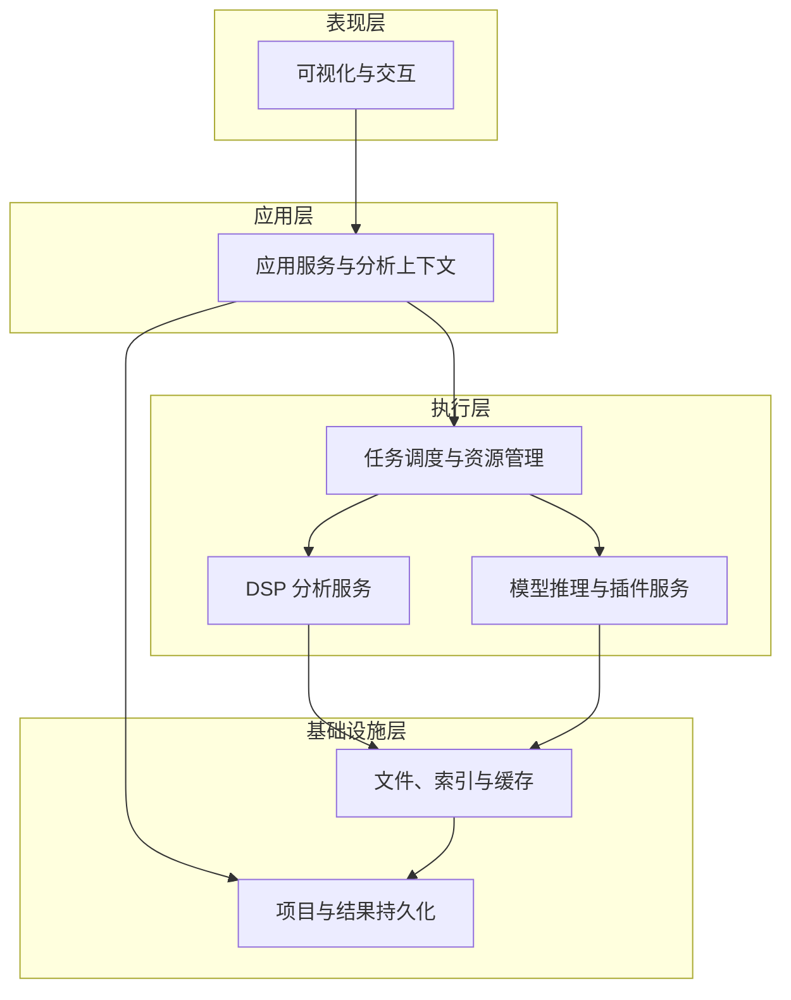
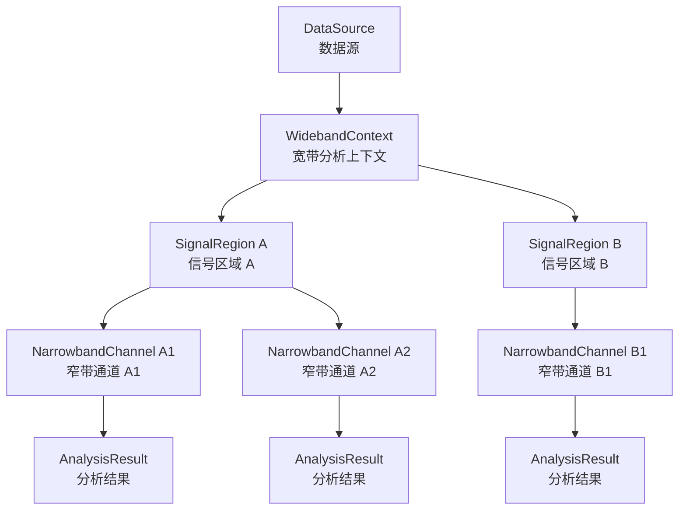
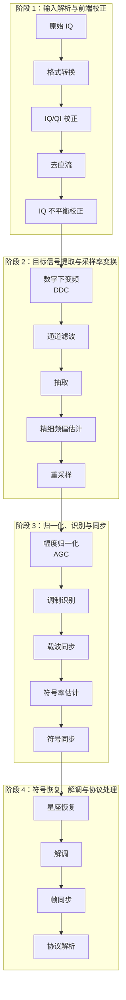

# Signal Studio 软件需求设计说明书（完整版）

> **文档类型**：软件需求规格说明书（SRS）与概要设计说明书
> **产品名称**：Signal Studio
> **目标版本**：V1.0
> **文档版本**：1.1
> **目标平台**：Windows 10/11 64 位
> **UI 框架**：Qt 6.11 + Qt Widgets
> **编译工具链**：Visual Studio 2022 + MSVC x64
> **构建系统**：CMake
> **核心语言**：C++17 或更高版本
> **算法扩展**：Python/PyTorch、ONNX Runtime、TensorRT
> **数据源类型**：离线 IQ 文件
> **修订日期**：2026-07-15
> **本次修订**：增加英文缩写解释；统一 LaTeX 公式；优化 Mermaid 图形布局

---

## 1. 文档目的

本文档用于完整定义 Signal Studio 的产品定位、业务边界、功能需求、总体架构、宽带与窄带联动机制、数据模型、DSP 处理链、可视化交互、任务调度、缓存与索引、模型与插件接口、项目持久化、性能指标、异常处理、测试验收和阶段交付范围。

本文档应作为以下工作的统一输入和约束：

- 产品需求评审；
- 软件架构设计；
- UI/UX 设计；
- C++/Qt 软件开发；
- DSP 算法开发；
- Python/PyTorch、ONNX Runtime 和 TensorRT 模型接入；
- 测试用例设计；
- 性能测试与验收；
- 安装包制作、发布和维护；
- Codex 或其他自动化开发工具执行项目任务时的主要需求依据。

---

## 2. 产品概述

### 2.1 产品定位

Signal Studio 是一款运行于 Windows 平台的专业离线数字信号可视化与分析软件，面向大容量 IQ 采样文件的加载、浏览、测量、选区、信号提取、参数估计、调制识别、解调和结果导出。

软件必须同时支持：

1. **宽带信号分析模式**：面向完整宽带 IQ 数据或较大时间范围的数据，提供全局时域、频域和时频域浏览，多信号发现、标记、测量、检测、分类管理和信号区域选择。
2. **窄带信号分析模式**：面向从宽带数据中提取的一个或多个目标信号，提供数字下变频、滤波、抽取、重采样、精细频谱和时频分析、参数估计、星座图、眼图、调制识别、解调及协议扩展分析。
3. **宽带—窄带联动分析模式**：宽带图谱中的信号区域可创建一个或多个窄带分析通道；窄带分析通道的时间范围、中心频率、带宽、识别结果和解调状态可映射并回写到宽带视图，实现完整双向联动。

### 2.2 核心价值

- 对超大离线 IQ 文件进行流畅、稳定、低延迟的可视化浏览；
- 建立“宽带发现—窄带提取—精细分析—结果回写”的完整闭环；
- 形成可复用、可追踪、可复现的 DSP 分析链；
- 支持传统信号处理算法与深度学习模型并存；
- 支持多个目标信号和多个窄带分析通道并行管理；
- 为后续调制识别、协议分析、批量处理、数据集制作和算法插件扩展提供稳定基础。

### 2.3 产品设计边界

本阶段软件不负责：

- SDR 硬件接入与射频设备控制；
- 实时采集与实时连续监测；
- 在线告警；
- 多机分布式计算；
- 云端协同分析；
- 一次性覆盖全部调制方式和通信协议；
- 对第三方插件提供无限制、无隔离的本地代码执行能力。

### 2.4 目标用户

- 通信信号分析工程师；
- 无线电测试工程师；
- 调制识别算法研发人员；
- 解调和协议分析人员；
- 数据集制作与验证人员；
- 高校和科研机构研究人员。

---

## 3. 术语、英文缩写与数学符号

### 3.1 术语与定义

| 术语           | 定义                                                                   |
| -------------- | ---------------------------------------------------------------------- |
| 宽带分析上下文 | 以原始 IQ 文件或其较大时间区间为输入的全局分析环境                     |
| 窄带分析通道   | 从宽带数据的指定时间、频率区域中提取的逻辑分析通道                     |
| 信号区域       | 在时间—频率平面中定义的目标信号区域，可由人工或算法生成               |
| 原始样本坐标   | 以原始文件样本索引为基准的时间坐标                                     |
| 绝对频率       | 基于文件中心频率计算得到的射频频率坐标                                 |
| 基带频率       | 相对于当前数据中心频率或目标信号中心频率的频率坐标                     |
| 图谱瓦片       | 按时间、频率和分辨率分块存储的时频显示数据                             |
| 多分辨率索引   | 用于不同缩放层级快速显示的时域、频域和时频概要                         |
| 分析链         | 由去直流、校正、频移、滤波、抽取、同步、识别和解调等步骤组成的处理流程 |
| 项目文件       | 保存数据源引用、选区、通道、参数、结果引用和工作区状态的文件           |
| 结果回写       | 将窄带分析结果同步到宽带信号对象和宽带图谱覆盖层                       |
| 交互任务       | 由缩放、拖动、选区、视图切换等用户操作触发的高优先级任务               |
| 后台任务       | 缓存预计算、批量分析、导出、识别等较低优先级任务                       |

### 3.2 英文缩写解释

| 分类       | 缩写         | 英文全称                                   | 中文含义与本文用法                                    |
| ---------- | ------------ | ------------------------------------------ | ----------------------------------------------------- |
| 文档与需求 | SRS          | Software Requirements Specification        | 软件需求规格说明书                                    |
| 用户界面   | UI           | User Interface                             | 用户界面                                              |
| 用户体验   | UX           | User Experience                            | 用户体验                                              |
| 信号数据   | IQ           | In-phase and Quadrature                    | 同相与正交分量；复基带信号通常表示为$I+\mathrm{j}Q$ |
| 信号数据   | QI           | Quadrature and In-phase                    | Q、I 交织顺序，与 IQ 顺序相反                         |
| 信号处理   | DSP          | Digital Signal Processing                  | 数字信号处理                                          |
| 射频系统   | SDR          | Software-Defined Radio                     | 软件定义无线电；本阶段不直接接入 SDR 硬件             |
| 信号处理   | DDC          | Digital Down Conversion                    | 数字下变频，将目标信号搬移至零中频或低中频            |
| 信号处理   | NCO          | Numerically Controlled Oscillator          | 数控振荡器，通常用于数字混频和频移                    |
| 信号处理   | FFT          | Fast Fourier Transform                     | 快速傅里叶变换                                        |
| 信号处理   | STFT         | Short-Time Fourier Transform               | 短时傅里叶变换                                        |
| 信号处理   | PSD          | Power Spectral Density                     | 功率谱密度                                            |
| 信号处理   | FIR          | Finite Impulse Response                    | 有限冲激响应滤波器                                    |
| 信号处理   | IIR          | Infinite Impulse Response                  | 无限冲激响应滤波器；可作为后续扩展                    |
| 信号处理   | AGC          | Automatic Gain Control                     | 自动增益控制或幅度归一化                              |
| 信号测量   | SNR          | Signal-to-Noise Ratio                      | 信噪比                                                |
| 信号测量   | CNR          | Carrier-to-Noise Ratio                     | 载噪比                                                |
| 信号测量   | EVM          | Error Vector Magnitude                     | 误差矢量幅度                                          |
| 信号测量   | ENBW         | Equivalent Noise Bandwidth                 | 等效噪声带宽，用于窗函数和 PSD 补偿                   |
| 调制与编码 | AM           | Amplitude Modulation                       | 幅度调制                                              |
| 调制与编码 | FM           | Frequency Modulation                       | 频率调制                                              |
| 调制与编码 | PM           | Phase Modulation                           | 相位调制                                              |
| 调制与编码 | PSK          | Phase-Shift Keying                         | 相移键控                                              |
| 调制与编码 | FSK          | Frequency-Shift Keying                     | 频移键控                                              |
| 调制与编码 | QAM          | Quadrature Amplitude Modulation            | 正交幅度调制                                          |
| 调制与编码 | OFDM         | Orthogonal Frequency-Division Multiplexing | 正交频分复用                                          |
| 调制与编码 | CRC          | Cyclic Redundancy Check                    | 循环冗余校验                                          |
| 计算平台   | CPU          | Central Processing Unit                    | 中央处理器                                            |
| 计算平台   | GPU          | Graphics Processing Unit                   | 图形处理器；用于渲染、推理或可选加速                  |
| 计算平台   | CUDA         | Compute Unified Device Architecture        | NVIDIA 通用并行计算平台                               |
| 模型推理   | ONNX         | Open Neural Network Exchange               | 开放神经网络交换格式                                  |
| 模型推理   | ONNX Runtime | Open Neural Network Exchange Runtime       | ONNX 模型跨平台推理运行时                             |
| 模型推理   | TensorRT     | Tensor Runtime                             | NVIDIA 高性能深度学习推理优化工具                     |
| 模型推理   | Top-K        | Top K Predictions                          | 置信度最高的前$K$ 个识别候选                        |
| 软件架构   | API          | Application Programming Interface          | 应用程序编程接口                                      |
| 软件架构   | ABI          | Application Binary Interface               | 应用二进制接口                                        |
| 软件架构   | SDK          | Software Development Kit                   | 软件开发工具包                                        |
| 软件架构   | IPC          | Inter-Process Communication                | 进程间通信                                            |
| 软件架构   | ID           | Identifier                                 | 对象、任务、结果等的唯一标识符                        |
| 软件架构   | DAG          | Directed Acyclic Graph                     | 有向无环图，用于表示处理任务依赖                      |
| 软件架构   | LRU          | Least Recently Used                        | 最近最少使用缓存淘汰策略                              |
| C++ 工程   | RAII         | Resource Acquisition Is Initialization     | 资源获取即初始化的 C++ 资源管理范式                   |
| Qt 渲染    | RHI          | Rendering Hardware Interface               | Qt 渲染硬件抽象接口                                   |
| 编译工具   | MSVC         | Microsoft Visual C++                       | Microsoft C/C++ 编译工具链                            |
| 文件格式   | RAW          | Raw Binary Data                            | 无通用头部定义的原始二进制数据                        |
| 文件格式   | WAV          | Waveform Audio File Format                 | 波形音频文件格式；可用于承载实信号或 IQ 数据          |
| 文件格式   | SigMF        | Signal Metadata Format                     | 信号元数据格式规范                                    |
| 文件格式   | MAT          | MATLAB Data File                           | MATLAB 数据文件                                       |
| 文件格式   | NumPy        | Numerical Python                           | Python 数值计算库及其`.npy`、`.npz` 数据格式      |
| 功率单位   | dB           | Decibel                                    | 分贝，对数比值单位                                    |
| 功率单位   | dBFS         | Decibels Relative to Full Scale            | 相对于数字满量程的分贝值                              |
| 功率单位   | dBm          | Decibels Relative to One Milliwatt         | 相对于$1\ \mathrm{mW}$ 的功率单位                   |
| 功率单位   | dBW          | Decibels Relative to One Watt              | 相对于$1\ \mathrm{W}$ 的功率单位                    |
| 性能指标   | FPS          | Frames Per Second                          | 每秒渲染帧数                                          |
| 版本优先级 | P0/P1/P2     | Priority 0/1/2                             | 必须、建议和后续实现的需求优先级                      |
| 里程碑     | M1/M2/M3/M4  | Milestone 1/2/3/4                          | 项目阶段性交付里程碑                                  |

### 3.3 数学公式与符号约定

本文档中的数学表达统一使用 LaTeX 语法：

- 行内公式使用 `$...$`；
- 独立公式使用 `$$...$$`；
- 物理单位使用正体，例如 `$\mathrm{Hz}$`、`$\mathrm{s}$`、`$\mathrm{dB}$`；
- 下标中的说明性文字使用 `\mathrm{}` 或 `\text{}`；
- 虚数单位统一写作 `$\mathrm{j}$`。

本文档主要数学符号如下：

| 符号                 | 含义                              |
| -------------------- | --------------------------------- |
| $t$                | 相对或绝对时间                    |
| $t_0$              | 数据文件或选区的起始时间          |
| $n$                | 原始样本索引                      |
| $F_s$              | 原始采样率                        |
| $f_c$              | 数据中心频率                      |
| $f_{\mathrm{bb}}$  | 基带频率                          |
| $f_{\mathrm{abs}}$ | 绝对射频频率                      |
| $K$                | Top-K 识别结果中的候选数量        |
| $\mathrm{j}$       | 虚数单位，满足$\mathrm{j}^2=-1$ |

---

## 4. 产品目标与非目标

### 4.1 产品目标

#### G-001 大文件可视化

软件应支持对大容量离线 IQ 文件进行分块读取、按需计算和多分辨率显示，不允许依赖完整文件载入内存。

#### G-002 宽窄带完整闭环

```text
宽带文件加载
→ 宽带时域/频域/时频浏览
→ 目标信号选择
→ 创建窄带分析通道
→ 频移/滤波/抽取/重采样
→ 参数估计/识别/解调
→ 结果回写宽带视图
→ 项目保存与恢复
```

#### G-003 高交互性能

缩放、平移、选区、游标测量、页面切换和通道切换过程中不得出现明显界面冻结。

#### G-004 可复现分析

任何分析结果均应能追溯到原始文件、原始样本范围、输入时间和频率范围、处理链参数、算法版本、模型版本、插件版本和软件版本。

#### G-005 可扩展架构

软件应支持文件格式、DSP 算法、识别模型、解调器、协议解析器和导出器的持续扩展。

### 4.2 非目标

V1.0 不要求支持实时数据流、SDR 设备控制、全部调制协议、跨平台版本、云端部署或无限数量分析通道。

---

## 5. 总体设计原则

1. **图谱优先**：数据访问、索引、缓存、计算和渲染围绕图谱交互性能设计。
2. **交互与计算解耦**：UI 主线程仅处理事件、轻量状态更新和绘制提交。
3. **分层渐进处理**：先低分辨率概览，后按需高分辨率计算。
4. **单一坐标基准**：所有结果均可映射回原始样本索引。
5. **状态可追踪**：选区、通道、任务、参数和结果均使用稳定 ID。
6. **渐进扩展**：优先稳定基础引擎，再扩展高级算法和协议。
7. **可取消与可降级**：耗时任务支持取消；GPU 或模型不可用时可降级运行。

---

## 6. 用户角色与典型用例

### 6.1 用户角色

| 角色           | 主要目标                                         |
| -------------- | ------------------------------------------------ |
| 信号分析工程师 | 浏览宽带数据、定位信号、创建分析通道、测量和解调 |
| 算法工程师     | 导入模型、验证识别算法、比较参数和模型结果       |
| 测试工程师     | 使用基准数据验证显示、测量、DSP 和导出正确性     |
| 数据集工程师   | 批量选择、导出窄带 IQ、标签和分析元数据          |
| 研究人员       | 进行多参数实验、保存结果并复现实验流程           |

### 6.2 核心用例

- UC-001：打开宽带 IQ 文件；
- UC-002：浏览和测量宽带图谱；
- UC-003：创建、编辑和管理信号区域；
- UC-004：基于信号区域创建窄带分析通道；
- UC-005：执行窄带精细分析；
- UC-006：调制识别与解调；
- UC-007：宽窄带双向定位；
- UC-008：多通道对比；
- UC-009：保存和恢复项目；
- UC-010：导出 IQ、图形、测量和解调结果。

---

## 7. 总体架构



核心子系统包括：

1. 文件与数据访问子系统；
2. 多分辨率索引与缓存子系统；
3. 宽带分析子系统；
4. 窄带分析通道子系统；
5. DSP 处理链子系统；
6. 任务调度与资源管理子系统；
7. 图谱渲染与交互子系统；
8. 模型推理与插件子系统；
9. 项目、结果和工作区持久化子系统；
10. 日志、诊断和异常恢复子系统。

建议代码模块：

```text
signal-studio/
├─ app/
├─ core/
│  ├─ data
│  ├─ coordinate
│  ├─ cache
│  ├─ task
│  ├─ result
│  └─ plugin
├─ dsp/
│  ├─ transform
│  ├─ filter
│  ├─ resample
│  ├─ estimator
│  ├─ synchronization
│  └─ demodulation
├─ visualization/
├─ inference/
├─ formats/
├─ export/
├─ plugins/
└─ tests/
```

---

## 8. 核心数据模型

### 8.1 `DataSource`

包含数据源 ID、路径、文件大小、文件指纹、数据格式、采样率、中心频率、起始时间、样本总数、IQ/QI 顺序、大小端、通道数、幅度标定、文件头偏移、只读状态和缓存状态。

### 8.2 `WidebandContext`

包含上下文 ID、数据源、当前时间与频率范围、FFT/STFT 参数、颜色映射、动态范围、活动信号区域、活动分析通道、图层配置、视图联动状态和测量状态。

### 8.3 `SignalRegion`

包含信号区域 ID、名称、标签、起止样本索引、最低/最高频率、中心频率、估计带宽、创建来源、置信度、状态、备注、颜色、关联通道列表、识别摘要和解调摘要。

### 8.4 `NarrowbandChannel`

包含通道 ID、关联信号区域、原始数据源、输入样本和频率范围、数字频移、滤波参数、抽取倍率、输出采样率、处理链、任务状态、中间结果、最终结果、显示颜色、锁定和冻结状态。

### 8.5 `AnalysisResult`

包含结果 ID、类型、所属通道、所属处理步骤、算法或模型名称与版本、输入参数、输出引用、置信度、状态、创建时间、可追溯信息和错误信息。

### 8.6 `ProcessingNode`

包含步骤 ID、步骤类型、输入输出结果 ID、参数、算法实现标识、版本、开始结束时间、状态、取消语义和缓存键。

### 8.7 对象关系



---

## 9. 时间与频率坐标系统

### 9.1 时间坐标

所有数据和结果应以 64 位整数原始样本索引作为基础时间坐标：

$$
t = t_0 + \frac{n}{F_s}
$$

其中，$t$ 为对应时间，$t_0$ 为文件起始时间，$n$ 为原始样本索引，$F_s$ 为原始采样率。

要求：

- 无绝对起始时间时使用相对时间；
- UI 可显示秒、毫秒、微秒和样本索引；
- 内部不得仅使用单精度浮点数保存长文件时间；
- 重采样结果必须保存与原始样本坐标的映射；
- 滤波群时延必须记录并补偿；
- 窄带结果映射回原始文件时，目标误差不超过一个原始样本。

### 9.2 频率坐标

对复数基带数据，绝对频率与基带频率的关系为：

$$
f_{\mathrm{abs}} = f_c + f_{\mathrm{bb}}
$$

其中，$f_{\mathrm{abs}}$ 为绝对射频频率，$f_c$ 为数据中心频率，$f_{\mathrm{bb}}$ 为相对于中心频率的基带频率。

要求：

- 支持绝对频率和基带频率切换；
- 无中心频率时默认显示基带频率；
- IQ/QI 顺序导致的频谱镜像必须明确处理；
- 实信号和复信号使用不同频谱显示规则；
- 数字频移后的窄带坐标仍可映射回宽带绝对频率。

---

## 10. 宽带分析模式需求

### 10.1 宽带数据浏览

- WB-001：支持完整文件或指定大时间区间的时域、频域和时频域显示。
- WB-002：首次打开应先显示低分辨率概览，不得等待完整索引。
- WB-003：支持绝对/基带频率轴、dBFS、标定功率单位、FFT/STFT 参数、颜色映射和动态范围调整。
- WB-004：支持滚轮缩放、框选缩放、平移、复位、十字游标、单双游标测量和范围历史。

### 10.2 宽带多视图联动

- WB-010：时域、频谱和时频图支持统一时间范围联动。
- WB-011：频谱计算范围应明确区分当前可见范围、当前选区、指定统计范围和全文件概要。
- WB-012：时间轴、频率轴、游标、选区和通道联动均可单独开关。
- WB-013：重计算期间保留旧结果或低分辨率结果，避免界面空白。

### 10.3 信号区域管理

信号区域应支持创建、移动、缩放、复制、删除、锁定、重命名、改色、标签、备注、合并、拆分、导入和导出。

一个信号区域可创建多个窄带通道。删除信号区域时，若存在关联通道，应提示同时删除、解除关联或取消。修改区域范围时，可自动更新通道、提示更新或保持通道冻结。

### 10.4 多信号管理

信号区域列表应支持按时间、中心频率、带宽、标签、创建来源、识别结果、置信度和解调状态排序筛选。

架构应支持一个逻辑信号包含多个不连续时间片，以便后续支持突发和跳频信号。

### 10.5 自动检测扩展

架构应预留能量检测、连通域检测、突发检测、峰值跟踪、频率漂移、跳频轨迹、多目标区域输出和批量创建通道能力。

---

## 11. 窄带分析模式需求

### 11.1 通道创建

创建窄带通道时应继承数据源、原始样本范围、时间范围、中心频率、频率范围、带宽、采样率、数据格式和幅度标定信息。

系统应自动推荐：

- 数字频移值；
- 通道滤波带宽；
- 过渡带；
- 抽取倍率；
- 输出采样率。

用户可覆盖推荐值。创建前必须检查频率越界、奈奎斯特条件、抗混叠、时间范围和资源预算。

### 11.2 窄带分析视图

至少支持：

- 窄带时域图；
- 精细频谱图；
- 精细时频图；
- 星座图；
- 眼图；
- 幅度/相位直方图；
- 符号轨迹；
- 参数估计结果；
- 调制识别结果；
- 解调结果；
- 处理链视图；
- 任务和错误状态。

### 11.3 分析页管理

支持标签页、并排比较、浮动窗口、重命名、复制、冻结、关闭和保存模板。非活动通道可降低计算优先级，但不得丢失已完成结果。

---

## 12. 宽带—窄带联动机制

### 12.1 联动目标

宽窄带联动必须覆盖：

- 数据坐标；
- 状态；
- 视图定位；
- 分析结果；
- 生命周期；
- 项目持久化。

### 12.2 宽带到窄带

- 从宽带信号区域直接创建窄带通道；
- 宽带选区变化时，可同步更新时间范围、中心频率、带宽、滤波参数和输出采样率；
- 双击宽带通道覆盖层可打开或激活对应窄带页；
- 当前选区和当前活动通道保持明确绑定。

### 12.3 窄带到宽带

- 窄带页改变时间范围时，宽带视图定位到对应原始样本范围；
- 修正中心频率和带宽时，可回写原信号区域；
- 识别结果回写调制类型、Top-K、置信度、模型版本和人工确认状态；
- 解调结果回写解调器、成功状态、帧数、校验率和摘要；
- “定位到宽带”应切换数据源、定位时间频率并高亮区域。

### 12.4 联动显示

每个通道应有唯一颜色或编号。宽带覆盖层显示通道名称、中心频率、带宽、状态和识别摘要。当前活动通道突出显示。

### 12.5 冲突处理

当宽带区域与窄带通道参数不一致时，允许：

- 以宽带更新窄带；
- 以窄带更新宽带；
- 保持独立；
- 创建通道副本。

---

## 13. DSP 标准处理链



每个处理步骤应支持启用/禁用、参数配置、自动建议、输入输出预览、后台执行、取消、缓存、错误报告、版本追踪和局部失效重算。

应允许保存或缓存原始选区 IQ、频移后 IQ、滤波后 IQ、抽取后 IQ、重采样后 IQ、同步后符号、软比特、硬比特、帧、音频和协议结构。

### 13.1 去直流

支持均值去除、滑动平均和高通滤波方式。

### 13.2 IQ 校正

支持 IQ 交换、I/Q 取反、增益不平衡和相位不平衡校正。

### 13.3 数字下变频（DDC）

DDC 应基于相位连续的数控振荡器（NCO）实现，并支持长数据分块处理。

### 13.4 滤波

至少支持 FIR 低通、FIR 带通、窗函数设计和自定义系数。

### 13.5 抽取和重采样

支持整数抽取、有理数重采样、多相滤波、抗混叠、块边界状态连续和群时延补偿。

### 13.6 FFT 和频谱

支持幅度谱、功率谱、PSD、峰值保持、平均、最大保持、窗函数增益补偿和等效噪声带宽（ENBW）补偿。

### 13.7 STFT

支持 FFT 长度、步长、重叠率、窗函数、线性功率/dB、分辨率提示和缓存失效管理。

### 13.8 特征分析

支持或预留包络、瞬时频率、瞬时相位、自相关、循环自相关、循环谱、高阶统计量和幅相直方图。

---

## 14. 参数估计需求

基础估计包括：

- 中心频率；
- 载波频偏；
- 占用带宽；
- $3\ \mathrm{dB}$/$6\ \mathrm{dB}$ 带宽；
- 信号功率；
- 峰值功率；
- 噪声底；
- SNR；
- 符号率；
- 采样时钟偏差；
- 初相位；
- 突发起止时间。

无标定时默认 dBFS；有标定时可显示 dBm 等物理单位。带宽必须区分 $3\ \mathrm{dB}$、$6\ \mathrm{dB}$、$99\%$ 占用带宽、阈值带宽和手工带宽。SNR 必须注明算法和适用条件。

每个估计结果应附带算法名称、参数、输入范围、适用条件、置信度或质量指标，以及失败或不可靠状态。

---

## 15. 星座图和眼图

### 15.1 星座图

支持原始采样点、载波同步前后、符号同步后、点图、密度图、时间着色、点数限制、理想参考点、EVM、幅度误差、相位误差、旋转归一化和数据导出。

### 15.2 眼图

支持 I、Q、幅度、多电平信号、每符号采样点、自动/手动符号率、同步前后对比、轨迹数量、密度显示、选定时间段和导出。

前置条件不满足时，应明确提示，不得显示无意义图形。

---

## 16. 调制识别需求

### 16.1 输入

- IQ 数据；
- 输入采样率；
- 中心频率；
- 时间范围；
- 估计带宽；
- 输入长度；
- 归一化方式；
- 预处理参数；
- 可选参数估计结果。

### 16.2 输出

- Top-1；
- Top-K；
- 候选置信度；
- 拒识状态；
- 输入有效性；
- 模型名称和版本；
- 标签集版本；
- 推理设备；
- 推理耗时；
- 错误信息。

### 16.3 模型管理

支持模型导入、启停、删除、版本、标签映射、输入长度、采样率和带宽范围、调制集合、CPU/CUDA/TensorRT 后端、设备选择、兼容性检查、自检、超时和失败隔离。

### 16.4 人工确认

用户可接受、修改、标记未知、添加备注和保存人工确认，同时保留模型原始输出。

---

## 17. 解调和协议分析

解调器输入包括 IQ 或同步后符号、采样率、符号率、载波频偏、调制类型和参数。

统一输出应支持：

- 符号序列；
- 软比特；
- 硬比特；
- 字节流；
- 音频；
- 帧；
- 时间戳；
- 置信度；
- 校验结果；
- 错误信息。

协议解析器应支持帧列表、字段树、原始字节、字段解释、校验状态、时间定位和跳转到对应 IQ/符号位置。

---

## 18. 文件与数据访问

### 18.1 首期格式

V1.0 至少支持 RAW IQ 和 WAV IQ；建议尽早支持 SigMF、`.npy`、`.npz` 和 `.mat`。

### 18.2 数据类型

至少支持 Int8、UInt8、Int16、UInt16、Int32、Float32、Float64、复数 Int16、复数 Float32 和复数 Float64。

### 18.3 RAW 导入配置

包括数据类型、符号性、大小端、IQ/QI、交织方式、实/复信号、文件头偏移、通道数、通道选择、采样率、中心频率、起始时间、幅度比例和满量程定义。

### 18.4 合法性检查

检查可读性、文件长度、尾部不完整样本、采样率、中心频率、数据类型和分析期间文件变化。

### 18.5 访问方式

采用内存映射、分块读取、异步预取或等效按需机制；禁止完整加载超大文件。

---

## 19. 多分辨率索引与缓存

### 19.1 时域索引

每级至少保存最小值、最大值、均方根、可选平均值和样本范围。

### 19.2 频谱概要与时频瓦片

瓦片元数据至少包括数据源 ID、时间/频率层级、起点、FFT 长度、步长、窗函数、功率单位、尺寸、精度和算法版本。

### 19.3 缓存键

至少包括：

- 文件大小；
- 修改时间；
- 文件头尾哈希；
- 数据格式参数哈希；
- 元数据哈希；
- 算法版本；
- 缓存格式版本；
- FFT/STFT 参数哈希；
- 软件构建版本。

### 19.4 生命周期

支持自定义缓存目录、项目缓存、共享缓存、单文件/全部清理、容量上限、LRU 淘汰、磁盘不足降级、损坏重建、任务取消和统计诊断。

缓存和项目文件应先写临时文件，再原子替换。

---

## 20. 任务调度与资源管理

### 20.1 任务类型

包括文件扫描、索引、图谱重计算、通道创建、滤波、抽取、重采样、参数估计、识别、解调、协议解析、导出和批量测量。

### 20.2 优先级

1. UI 交互反馈；
2. 当前可见图谱；
3. 当前活动窄带通道；
4. 用户显式分析；
5. 当前项目缓存补全；
6. 后台预计算；
7. 批量分析和导出。

### 20.3 取消语义

任务应声明立即取消、安全点取消、当前块完成后取消或不可中断但忽略结果。取消后应明确部分结果、临时文件和缓存有效性。

### 20.4 过期请求

用户快速改变视图时，旧请求应标记过期，不再提交结果，并尽快取消。

### 20.5 依赖图

支持任务依赖、失败传播、共享中间结果、任务去重、局部重算、结果缓存和多通道共享读取块。

### 20.6 资源预算

提供 CPU 线程、磁盘并发、内存、显存、GPU 推理并发和单通道资源上限。资源不足时应降级而非崩溃。

### 20.7 多通道

当前活动通道优先，可见通道次优先，后台通道可暂停或降速。GPU 推理应排队或受控并发。

---

## 21. 可视化与交互

### 21.1 主界面布局

- 顶部：菜单、工具栏、项目和数据源状态；
- 左侧：项目树、文件、信号区域和通道列表；
- 中央：宽带和窄带主图谱；
- 右侧：参数、属性、处理链和模型；
- 底部：任务、结果、日志和诊断；
- 状态栏：时间、频率、采样率、缓存和设备状态。

### 21.2 图层系统

至少包括原始图谱、信号区域、分析通道、游标、测量、标记、检测结果、识别结果和用户注释层。

### 21.3 撤销恢复

支持选区、通道、参数、标签、布局和图层操作的撤销恢复。

### 21.4 工作区

支持宽带、窄带、多通道对比和自定义工作区的保存、恢复和重置。

### 21.5 可用性

默认中文，预留英文；提供工具提示、参数合法性提示、快捷键、上下文菜单、最近文件、首次引导和空状态说明。

---

## 22. 图谱渲染技术要求

海量数据不得逐点使用 QPainter。优先使用 Qt RHI、OpenGL、GPU 纹理、高性能自定义图元、数据抽稀和屏幕像素聚合。

绘制数据量应与屏幕像素或瓦片数量相关，而不是与原始采样点数量直接相关。

视图应渐进显示：

1. 显示已有缓存；
2. 无缓存时显示粗略结果；
3. 后台计算高分辨率结果；
4. 无闪烁替换。

色阶至少支持 Viridis、Inferno、Magma、Plasma、Turbo、Jet、Gray 和自定义色阶。

---

## 23. 项目文件与持久化

项目保存：

- 项目和软件版本；
- 数据源、路径和指纹；
- 数据格式；
- 信号区域；
- 分析通道；
- 处理链；
- 算法参数；
- 模型和插件版本；
- 结果引用；
- 标记和注释；
- 工作区布局；
- 图谱配置；
- 导出记录。

路径同时保存相对路径、绝对路径和文件指纹。文件移动后支持自动搜索、重新定位和只读降级。

项目格式必须版本化，支持旧版本迁移、升级前备份、未知字段忽略和插件缺失降级打开。

支持定时自动保存、重要操作后保存、崩溃恢复和临时项目恢复。

---

## 24. 模型推理服务

支持：

1. ONNX Runtime 进程内推理；
2. TensorRT；
3. Python/PyTorch 独立进程服务。

推荐 Python 独立进程，避免 GIL、崩溃和依赖污染。

IPC 可采用本地管道、套接字或共享内存。大块 IQ 数据不得使用低效文本序列化。

服务管理应支持启动、停止、健康检查、自动重启、超时、崩溃检测、日志、环境检查、GPU 检查和模型预热。

推理失败不得破坏项目，应支持 CPU 回退和重新执行。

---

## 25. 插件架构

插件类型：

- 文件格式；
- DSP；
- 参数估计；
- 调制识别；
- 解调；
- 协议解析；
- 结果导出。

插件不得直接操作主窗口内部对象，应通过稳定服务接口请求数据、创建任务、读取上下文、提交结果、写日志和报告进度。

如首期采用 C++ 插件，必须要求相同 MSVC、Qt 和运行库，进行 SDK/接口版本检查，并禁止异常跨模块边界。

长期应演进为版本化 C ABI 或进程外插件协议。对不可信插件建议进程隔离。

---

## 26. 导出需求

### 26.1 IQ

支持 RAW、WAV、SigMF、NumPy 和可选 MAT。可配置类型、IQ 顺序、采样率、中心频率、起始时间、归一化和伴随元数据。

### 26.2 图形

支持 PNG、SVG、PDF 和剪贴板；可配置分辨率、DPI、坐标、图例、游标、标记和色条。

### 26.3 测量

支持 CSV、JSON、可选 Excel 和 Markdown 报告。

### 26.4 解调

支持符号、软比特、硬比特、字节流、WAV、帧列表和协议 JSON。

### 26.5 可追溯信息

导出结果应包含原始文件、样本范围、时间频率范围、处理链、软件/插件/模型版本、导出时间、单位和校验值。

---

## 27. 日志、诊断与异常处理

日志级别至少包括 Debug、Info、Warning、Error 和 Critical。

记录文件解析、缓存、任务、算法参数、模型插件、GPU、内存显存、推理服务、项目保存和导出。

应处理：

- 文件损坏或长度不匹配；
- 元数据缺失或参数非法；
- 磁盘读取失败和网络盘断开；
- 文件分析期间被修改；
- 缓存或项目损坏；
- 内存、显存和磁盘不足；
- GPU 不可用；
- Python 服务崩溃；
- 插件加载失败；
- 算法异常。

支持自动保存、崩溃恢复、事务性写入、崩溃报告和诊断包导出。

---

## 28. 非功能需求

### 28.1 性能

- 普通 UI 事件视觉响应目标低于 $50\ \mathrm{ms}$；
- 图谱最低目标 $30\ \mathrm{FPS}$，常规目标 $60\ \mathrm{FPS}$；
- 视图切换优先低分辨率首帧；
- 禁止完整加载超大文件；
- 后台任务不得阻塞 UI；
- 快速改变视图时仅保留最新请求。

### 28.2 性能基线

正式验收前必须定义 CPU、内存、GPU、显存、磁盘、分辨率、文件大小、采样率、FFT 长度、时频图尺寸和通道数量。

分别测量：

- 首次打开；
- 缓存命中打开；
- 低分辨率首帧；
- 高分辨率替换；
- 缩放和平移；
- 创建通道；
- 通道切换；
- 项目保存恢复；
- 导出吞吐；
- 多通道并发。

### 28.3 稳定性和兼容性

- 单任务、单模型或单插件失败不得导致程序退出；
- 资源使用不得持续无界增长；
- 无独立 GPU 时基础功能可运行；
- 远程桌面和虚拟显示环境提供渲染降级；
- 项目和缓存写入防止部分写入损坏。

### 28.4 可维护性

- 核心模块低耦合；
- 服务接口版本化；
- 算法可单元测试；
- 关键数据结构有序列化测试；
- 公共 API 有中文说明。

---

## 29. 测量正确性验收框架

| 指标       | 验收条件框架                        |
| ---------- | ----------------------------------- |
| 时间映射   | 不超过 1 个原始样本                 |
| 频率坐标   | 不超过一个显示频点或规定 Hz         |
| 数字下变频 | 与参考实现结果在容差内一致          |
| 重采样长度 | 理论长度误差不超过 1 个输出样本     |
| 群时延补偿 | 与理论值或参考实现一致              |
| 功率测量   | 在标定数据下满足规定 dB 误差        |
| 占用带宽   | 在指定 SNR 和观测长度下满足比例误差 |
| 载波频偏   | 满足 Hz 或符号率比例误差            |
| 符号率     | 满足规定百分比误差                  |
| 星座点     | 与参考同步结果在 EVM 容差内         |
| IQ 导出    | 与选区和处理结果逐样本或容差一致    |

---

## 30. 测试数据集

至少包括：

- AM、FM、PM；
- BPSK、QPSK、OQPSK、8PSK；
- 2FSK、4FSK、MSK、GMSK；
- 16QAM、64QAM；
- OFDM；
- 多信号宽带混合；
- 突发；
- 跳频；
- 频率漂移；
- 不同 SNR、采样率、IQ 顺序和大小端；
- 直流偏置和 IQ 不平衡；
- 有/无标定；
- 大文件；
- 文件尾不完整；
- 损坏项目和缓存。

测试数据应附生成参数、参考结果、校验值、允许误差和适用用例。

---

## 31. 核心验收用例

### AT-001 文件导入

导入 RAW IQ，配置格式，验证样本数和频率轴，保存并重新打开。

### AT-002 大文件浏览

打开标准大文件，快速出现低分辨率首帧，连续缩放和平移时 UI 不冻结、任务不堆积。

### AT-003 宽窄带联动

框选宽带信号、创建窄带通道、验证时间频率映射、回写中心频率、定位回宽带，并验证项目恢复后关系保持。

### AT-004 多通道

同一区域创建两个通道，设置不同参数，并行显示，结果互不覆盖。

### AT-005 DSP 正确性

对照参考实现验证频移、滤波、抽取、重采样、FFT、STFT 和估计结果。

### AT-006 任务取消

取消大缓存任务后 UI 保持可用，临时文件和缓存状态正确。

### AT-007 模型失败隔离

识别服务崩溃时主程序继续运行，服务可重启并重新提交任务。

### AT-008 项目恢复

恢复多个区域、通道、参数和工作区；文件缺失时可重新定位。

### AT-009 异常处理

覆盖文件/缓存损坏、磁盘内存显存不足、GPU 不可用和插件不兼容。

---

## 32. 需求优先级

### P0：V1.0 必须实现

- IQ 导入和格式配置；
- 大文件分块访问；
- 多分辨率时域、频谱和时频图；
- 缩放、平移、选区和测量；
- 信号区域管理；
- 宽带到窄带通道创建；
- 宽窄带双向定位；
- 频移、滤波、抽取和重采样；
- 窄带时域、频谱和时频图；
- 基础参数估计；
- 项目保存和恢复；
- 任务进度、取消和日志；
- 数据与图形导出；
- CPU 环境下完整运行基础功能。

### P1：建议 V1.x 实现

- 星座图和眼图；
- 多通道并排对比；
- 调制识别接口；
- ONNX Runtime；
- Python 推理服务；
- 自动检测接口；
- 批量分析；
- SigMF；
- 标记导入导出；
- 结果报告。

### P2：后续扩展

- 循环谱和高阶统计量；
- TensorRT 深度优化；
- 协议解析插件；
- 跳频轨迹分析；
- 自动多目标检测；
- 第三方插件 SDK；
- 数据集批量生成和标注；
- 脚本自动化接口。

---

## 33. 版本里程碑

### M1：宽带浏览基础

文件导入、格式配置、分块读取、时域/频谱/时频图、缩放平移游标、低分辨率缓存和基础项目文件。

### M2：宽窄带联动闭环

信号区域、逻辑通道、频移、滤波、抽取、重采样、窄带图谱、双向定位和项目恢复。

### M3：专业分析能力

参数估计、星座图、眼图、调制识别接口、ONNX/Python 服务、结果导出和多通道比较。

### M4：工程化发布

安装包、崩溃恢复、诊断包、性能优化、完整测试、用户文档和接口文档。

---

## 34. 主要风险与应对

### 34.1 高性能渲染

采用渲染后端抽象、CPU 降级、屏幕像素聚合、多分辨率瓦片和标准测试矩阵。

### 34.2 时频缓存体积

采用分层缓存、按需生成、参数哈希、容量上限和后台低优先级预计算。

### 34.3 宽窄带状态复杂度

使用稳定对象 ID、明确关联关系、冲突策略、状态机和序列化测试。

### 34.4 Python/CUDA 环境

采用进程隔离、环境自检、CPU 回退、ONNX Runtime 优先和明确版本矩阵。

### 34.5 首期范围过大

严格按 M1—M4 交付，先完成宽窄带闭环，高级模型和协议后置。

---

## 35. 开发规范

### 35.1 C++/Qt

- 遵循统一命名；
- 使用 RAII；
- 明确线程归属；
- 禁止后台线程直接操作 QWidget；
- 避免核心逻辑写入 UI 类；
- 公共接口使用稳定数据类型；
- 关键模块提供单元测试。

### 35.2 Python

- 推理服务与主程序隔离；
- 明确 Python 和依赖版本；
- 接口使用类型定义；
- 记录输入输出；
- 提供超时和异常处理；
- 禁止无日志静默失败。

### 35.3 注释和文档

类、公共函数、复杂算法、关键变量、并发模型、缓存格式、插件接口和外部 API 均应提供统一风格中文注释。

### 35.4 测试

至少包括单元测试、集成测试、UI 核心流程测试、DSP 数值回归、项目序列化、性能基准、异常恢复和安装包测试。

---

## 36. 交付物

1. Windows x64 安装包；
2. 可运行主程序；
3. CMake 工程和源代码；
4. 自动化构建脚本；
5. 单元和集成测试；
6. 基准测试数据；
7. 软件使用手册；
8. 文件格式说明；
9. 项目文件说明；
10. 插件和模型接口说明；
11. DSP 算法说明；
12. 测试报告；
13. 性能测试报告；
14. 已知问题清单；
15. 版本发布说明。

---

## 37. 完成定义（Definition of Done）

功能只有同时满足以下条件才视为完成：

- 需求已实现；
- 正常和异常流程可用；
- UI 无明显阻塞；
- 日志完整；
- 参数可持久化；
- 结果可追踪；
- 测试通过；
- 性能满足基线；
- 用户文档已更新；
- 不破坏已有项目兼容性。

---

## 38. 总结

Signal Studio V1.0 的首要目标不是一次性覆盖所有调制类型和通信协议，而是建立稳定、可扩展的离线信号分析基础设施。

必须优先保证：

1. 大容量 IQ 文件高性能访问；
2. 多分辨率时域、频域和时频图谱；
3. 信号区域与多通道管理；
4. 宽带与窄带双向联动；
5. 可复现 DSP 处理链；
6. 可取消、有优先级的后台任务；
7. 稳定的项目保存和恢复；
8. 传统算法与智能算法隔离接入；
9. 明确、可执行的性能和正确性验收体系。

完整业务闭环：

```text
离线 IQ 数据
→ 宽带全局浏览
→ 信号发现与标记
→ 创建窄带分析通道
→ 精细 DSP 处理
→ 参数估计
→ 调制识别
→ 解调与协议扩展
→ 结果回写
→ 导出、保存与复现
```
