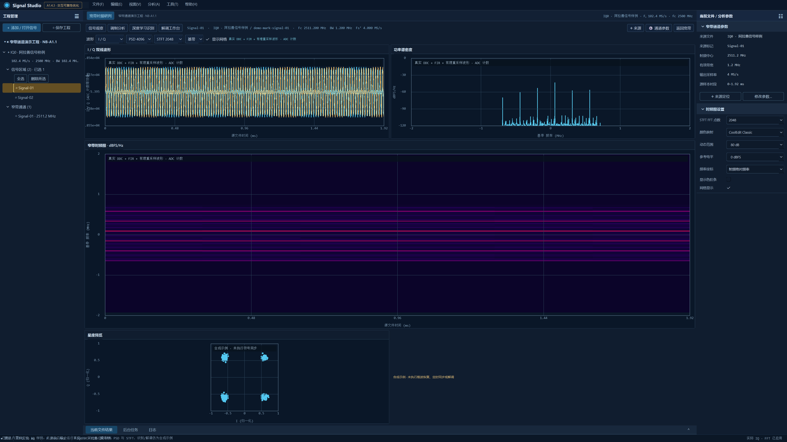

# 波形与 PSD 绘制回归修复（2026-10-10）

宽带、窄带波形和 PSD 的右偏、网格消失、交互反馈缺失及曲线越过坐标轴问题已修复。窄带 Esc 取消已接入主窗口；拖动期间捕获鼠标，取消和完成时释放。网格开关及既有波形包络、ADC 计数、75% 居中适配规则保留。

## 根因与修复

1. 几何提供器输出 QWidget 相对坐标 0–1，GPU 着色器接受 NDC -1–1。共享上传层现在转换 X 和后端 Y 方向，宽带、窄带使用同一规则。
2. 曲线绘制绑定了曲线顶点缓冲，覆盖层没有重新绑定全窗口四边形。现在显式恢复覆盖层缓冲，坐标、单位、网格、悬停和选区与图内手势使用相同绘图区。
3. QPainter 的绘图区裁剪没有传递到 GPU 数据绘制。现在所有几何图谱传入绘图区，GPU scissor 限制数据内容，覆盖层恢复全窗口范围。
4. 主窗口的全局 Esc 过滤器只取消宽带手势。现在同时检查并取消窄带拖动、滚轮待提交历史，回滚独立幅值/功率轴范围。

## 验证

| 项目 | Debug | Release |
|---|---|---|
| 构建及输出目录运行库部署 | 通过 | 通过 |
| CTest | 4/4 | 4/4 |
| 完整 Qt UI 回归（offscreen 软件回退） | 72 passed / 0 failed / 0 skipped | 72 passed / 0 failed / 0 skipped |
| 原生波形/PSD 像素及交互回归 | 4 passed / 0 failed / 0 skipped（含初始化、清理） | 同左 |
| 宽带 GPU 独立启动 | 通过 | 通过 |
| 窄带四页 GPU 独立启动 | 通过 | 通过 |

原生回归检查曲线覆盖绘图区四个横向分区、网格开关改变左半部实际像素、缩小纵轴后曲线不进入坐标区，以及时间/频率锚点、独立纵轴、轴拖动、框选、连续滚轮历史合并和 Esc 回滚。像素测试读取 QRhi framebuffer，硬件模式要求真实 GPU 数据 draw call；仅上传计数不能证明位置正确。新增槽为 `widebandAuxiliaryRenderingAndGestures`、`narrowbandAuxiliaryRenderingAndGestures`，可从 `SignalStudioUiTests.exe` 单独执行。

原生窗口严格使用连接序号 2、Redmi 27 NU、`\\.\DISPLAY6`，3840×2160 物理尺寸、DPR 1.5、2560×1440 逻辑全屏。后端为 D3D11 / AMD Radeon(TM) 880M Graphics。四套硬件烟测都从各自包目录以系统 PATH 启动，记录数据绘制、顶点更新、热图上传及完成帧。Release 的宽带/窄带软件回退另行通过，记录中 `hardwareRenderer=false`。

实际文件 `IQ0_FS102.4Msps_BW80MHz_FC830MHz_20260805_155446.dat`（3,817,472,000 字节，与用户截图同名）完成 Release 波形及 PSD 的原生硬件运行，主图滚轮缩放后视图和图谱重新就绪。该验证使用初始可见时间窗，不等同于全时段 DDC、内存压力或持续吞吐验收。图谱严格裁剪到当前纵轴，低于当前 PSD 纵轴下限的功率值不会绘制到坐标区。

机器汇总见 [report.json](chart-regression-2026-10-10/report.json)，日志、渲染报告和截图见 [证据目录](chart-regression-2026-10-10/)。本记录只覆盖此次绘制与交互回归，NB-A1.1 其余未完成项仍以[窄带验收记录](narrowband.md)为准。

