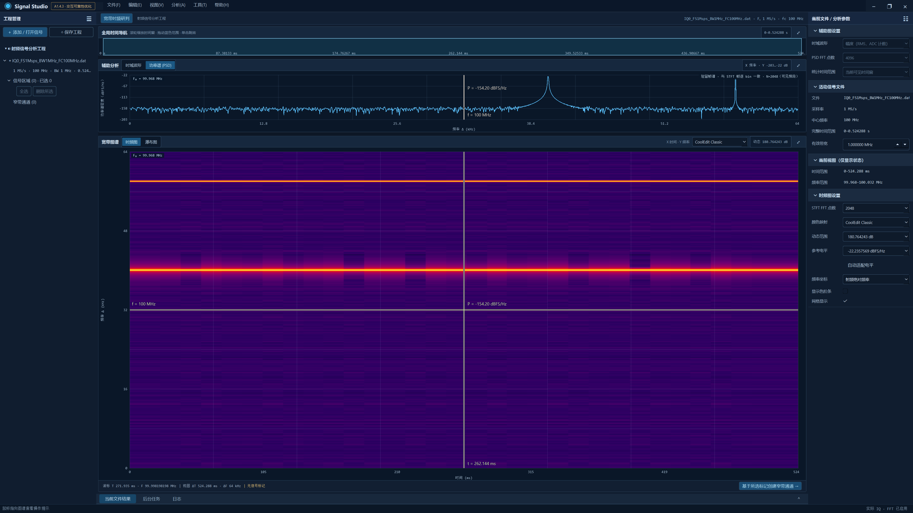
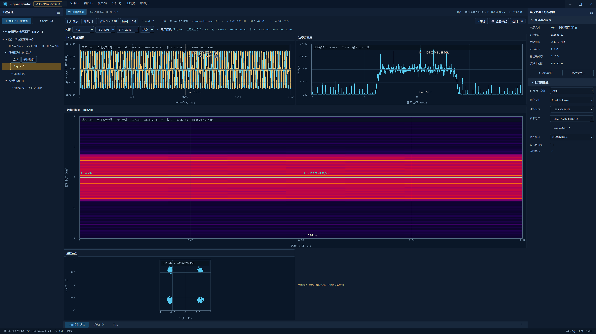

# 色阶、反色游标与窗口交互验收

实施分支为 `rebuild/a143-native`，基线提交 `6966b821ce634b0bf9e3d2eb26cf4ce2b9437278`。本次交付包含即时色阶输入、PSD 纵轴联动、一次性电平适配、坐标轴端点标注、无背景反色游标/文字、宽窄带交互反馈及自定义窗口顶栏。机器汇总见 [summary.json](summary.json)，实现与状态约定见 [架构说明](../../architecture/power-and-window-interactions.md)。

## 构建与自动回归

| 配置 | 构建 | CTest | Qt UI | 独立运行 |
|---|---|---|---|---|
| Debug | 通过 | 5/5 | 78 passed / 0 failed / 0 skipped | 输出目录、系统 PATH，通过 |
| Release | 通过 | 5/5 | 78 passed / 0 failed / 0 skipped | 输出目录、系统 PATH，通过 |

完整日志分别位于 [Debug](debug/ctest.log)、[Release](release/ctest.log)，各目录同时保留构建日志和测试明细。UI 自动回归使用 offscreen / QWidget 软件回退；它只证明交互和状态行为。硬件绘制另由原生验收和 GPU smoke 验证。

新增测试覆盖完整线性功率的极值适配、上下 3 dB、恒定功率、无效/零/负值、功率下限和合法边界；文件/通道纵轴同时应用、手动覆盖、历史和驻留保持、极端合法工程范围往返；有效输入即时应用、负号中间态及焦点保持；驻留与边缘标签布局；共用命中反馈；顶栏按钮与恢复几何。反色测试比较暗底、亮底、彩色底上的线条和文字像素，验证未覆盖位置保持原值、十字交点只反色一次。

## 原生显示与硬件证据

两种配置均只在连接序号 **2** 的 **Redmi 27 NU** 上验收，Windows 原生设备路径 **`\\.\DISPLAY6`**。实际屏幕和截图均为 **3840×2160**，DPR **1.5**；全屏逻辑客户区 **2560×1440**。普通/最大化动作也在同一屏幕执行，最后恢复全屏。最大化使用当前屏幕 **2560×1392** 的可用工作区。

实际后端为 **QRhi D3D11 / AMD Radeon(TM) 880M Graphics**，vendor `0x1002`、device `0x150e`。保留 GPU 数据 draw calls、顶点/功率纹理更新、已完成帧以及反色蒙版 draw calls；这不是把 CPU 绘制的整幅数据图作为纹理上传。软件回退报告单列，GPU 调用为零。

| 验收项 | 结果与证据 |
|---|---|
| 有效自定义 D/R 输入即刻生效 | 宽、窄带均通过；无需回车，焦点和编辑内容保留 |
| 中间负号及非法范围 | 不覆盖最近有效参数；结束编辑恢复规范格式 |
| PSD 纵轴联动 | 输入 `D=87.5`、`R=−35.25`，纵轴精确为 `[−122.75,−35.25]` |
| 一次性自动适配 | 当前热图及平均/驻留 PSD 完整数值极值，上下各 3 dB；与共享计算函数一致 |
| 色阶与适配复用 | 宽带 `powerGenerations`、窄带 `requestGeneration` / `iqCacheMisses` 不变 |
| 游标文字 | 无背景、无边框，单侧排列，无标签与游标线交叠，边缘限位 |
| 反色实际像素 | Debug / Release 宽窄带分别 4/4 线条采样通过；文字分别 146 / 143 个像素匹配 `255−背景`，容差 8/255 |
| 驻留与三图联动 | 离开鼠标后坐标和读数保留，帧谱与热图逐 bin 一致；时频/瀑布方向均覆盖 |
| 游标资源复用 | 悬停前后数据纹理和顶点上传计数不变，允许更新覆盖层与反色蒙版 |
| 宽窄带反馈 | 绘图区十字、轴悬停张手、平移握手、同色轴高亮；释放/离开/Esc 清理临时状态 |
| 顶栏按钮 | 最小化、最大化/窗口化、关闭均通过；工程与驻留保持 |
| 原生拖动/缩放 | Windows 原生输入触发系统移动和边缘缩放；空白双击、菜单隔离和几何恢复通过 |
| GPU 资源恢复 | 窗口动作后重新回到全屏；宽带和窄带四页继续硬件绘制 |
| 独立部署 | 清理 Qt 环境变量，仅系统 PATH，从对应包目录启动 |

完整机器报告：[Debug](debug/linked-cursor-report.json)、[Release](release/linked-cursor-report.json)。每种配置各保存 10 张全屏截图，覆盖宽带波形、帧谱、瀑布、窄带四页、驻留文字及大文件。





## 大文件与运行边界

真实输入为 `IQ0_FS102.4Msps_BW80MHz_FC830MHz_20260805_155446.dat`，实际大小 **3,817,472,000 bytes**。覆盖通道创建、浏览/缩放、参数编辑以及取消关闭场景。此次单次测量初始显示：Debug **1891 ms**，Release **219 ms**；完整来源路径、配置/请求代次、实际帧数、缓存与绘制计数保存在 `largeIq` 字段。这些数值是本机本次测量，不是吞吐或稳定性能保证。

初始窄带 IQ 缓存约 **400,000 bytes**，分析矩阵约 **390 kB**，未预提取整个文件。全程进程峰值工作集 Debug **5,314,818,048 bytes**、Release **5,394,952,192 bytes**；采样私有内存峰值分别 **1,490,944,000**、**1,499,758,592 bytes**。进程数值包含只读映射页、Qt/QRhi、各页资源及测试过程，不能等同于 IQ/分析缓存预算。

8 项 smoke 全部通过：Debug/Release × 宽/窄带 × GPU/软件回退。机器报告、屏幕清单、截图及脚本日志位于 [smoke](smoke/)，GPU 窄带 smoke 分别覆盖全部四页。

本次范围没有未通过项。已验证平台仅 Windows x64 / Qt 6.11.1 / D3D11；Ubuntu 和其它 QRhi API 未验证。星座、眼图、识别、解调继续明确标注为合成演示，硬件显示验证不代表真实识别或解调算法完成。

## 复现

```powershell
./scripts/build.ps1 -Configuration Debug
./scripts/build.ps1 -Configuration Release
./scripts/verify-linked-cursors.ps1 -Configuration Debug -OutputDirectory artifacts/display-optimization/debug -IqFile '<真实 IQ 路径>'
./scripts/verify-linked-cursors.ps1 -Configuration Release -OutputDirectory artifacts/display-optimization/release -IqFile '<真实 IQ 路径>'
./scripts/gpu_smoke.ps1 -Configuration Release -OutputDirectory artifacts/display-optimization/smoke
./scripts/gpu_smoke.ps1 -Configuration Release -OutputDirectory artifacts/display-optimization/smoke -Narrowband
./scripts/gpu_smoke.ps1 -Configuration Release -OutputDirectory artifacts/display-optimization/smoke -SoftwareRenderer
./scripts/gpu_smoke.ps1 -Configuration Release -OutputDirectory artifacts/display-optimization/smoke -Narrowband -SoftwareRenderer
```

验收脚本自行生成确定性 IQ 夹具；它属于临时输入，不加入交付文档。可运行包分别位于 `out/vs2026-qt611-debug_bin` 与 `out/vs2026-qt611-release_bin`，随构建部署 Qt 插件与对应 CRT。
