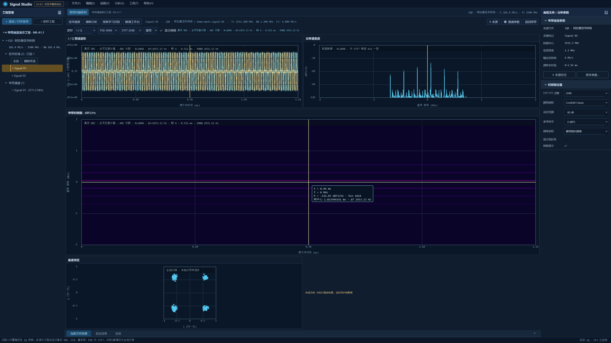

# 宽窄带游标、帧谱和频段 FFT 验收

本轮已实现悬停数值读数、三图驻留游标、实际 STFT 帧 PSD、固定 N 可见频段分析、时间窗不足的显式扩展，以及窄带完整可见范围的按需绘制。汇总见 [机器报告](report.json)，接口与资源边界见 [架构说明](../../architecture/linked-spectral-analysis.md)。

Debug、Release 全目标构建及 CTest 均为 **5/5 通过**；Qt UI 各 **74 passed / 0 failed / 0 skipped**。Debug CTest 本次 172.00 s，Release 35.96 s。测试包括宽带回归、包络/75% 自动适配、逐样本位置、坐标/网格/轴交互、窄带星座与色阶、游标和帧谱、工程替换以及真实 IQ 算法边界。

## 验收矩阵

| 行为 | 验证及结果 |
|---|---|
| 波形/PSD 悬停竖线，热图十字线 | UI 与原生 QPA 鼠标事件通过；读数使用数值数据，框限制在绘图区 |
| 驻留时间/频率联动及辅助区模式切换 | 宽窄带 UI 通过；PSD 单击保留时间，RF 标签保留基带坐标 |
| 点击实际帧后 PSD | 逐 bin 相同，有效 N 随 STFT，原平均 PSD N 保留；原生读数对照通过 |
| 时间/频率缩放和平移联动 | 对应图谱范围共享，幅值/功率轴独立；既有手势、标记及 Esc 回滚回归通过 |
| 窄带参数入口一致 | 右侧栏与顶部 FFT、RF/基带、网格双向同步；真实矩阵 N 与控件一致，宽带参数保留 |
| N 表示可见频段点数 | 缩小 B 后保持 N，提高真实采样时长、减小 Δf；邻近双音数值验证通过 |
| 时间窗不足 | 保留视图和 N，提示所需时长；显式扩展后恢复分析，禁止借用窗外样本 |
| 真实数值 | 直接 DFT、负频偏、噪声积分功率、边界、取消、超过 `2^53` 的索引及 SciPy 对照通过 |
| 悬停资源复用 | 宽带 FFT/数据纹理/顶点上传不变；窄带请求代次/IQ misses/数据上传不变 |
| 窄带完整时间覆盖 | 取消前 150 万输出样本限制，完整可见范围分箱/选帧，保留实际坐标 |
| 工程与上下文隔离 | 新建/导入代次、删除与配置失效、文件/通道驻留隔离回归通过 |
| 原生 GPU | 两个配置的宽带和窄带四页均通过，非 CPU QRhi 驱动、顶点/纹理更新和完成帧有证据 |
| 软件回退 | 两个配置的宽带与窄带均通过，报告明确为 QPainter，GPU 计数为零 |

## 数值、显示器与大 IQ

同 FIR 系数、同可见区间的 SciPy 1.17.1 对照：256 点，真实输入 41,984 样本，峰值 bin 均为 154；最大绝对功率误差 **8.610647611595468e-10**，所有点满足 `1e-10 + 1e-5 × expected`。这是频段 FIR/CZT 功率对照，不代表通道 DDC/重采样全部复样本的 SciPy 对照。

所有原生截图来自当前连接屏 **2 / Redmi 27 NU / `\\.\DISPLAY6`**，全屏逻辑 2560×1440、物理 3840×2160、DPR 1.5。GPU 为 **D3D11 / AMD Radeon(TM) 880M Graphics**。程序从各自部署目录启动，PATH 仅包含 Windows 系统目录，没有 Qt 安装或外部源码目录参与运行。

本机 IQ 文件实际为 **3,817,472,000 字节**。使用其 25 ms 片段创建 1 MHz 带宽、2 MS/s 通道；初次显示 Debug **1869 ms**、Release **230 ms**。随后缩放、启动高抑制配置计算并替换为快速预览，最终为配置 v3，无旧任务覆盖。IQ 缓存和谱矩阵均保持各自预算内，具体命中/未命中、代次及 GPU 更新见原生 JSON。

整套原生场景的进程峰值工作集 Debug **5,070,381,056 字节**、Release **5,136,568,320 字节**；采样峰值私有内存分别为 **1,281,081,344**、**1,235,628,032 字节**。这些数值包含源文件映射页及 Qt/QRhi 资源，不能当成 IQ/分析 LRU 的大小；也不能将单次显示耗时描述为连续吞吐。该进程峰值尚未做专门优化。

## 证据和复现

- [Debug 原生报告](debug/linked-cursor-report.json)、[Release 原生报告](release/linked-cursor-report.json)
- [Debug CTest](ctest-debug.txt)、[Release CTest](ctest-release.txt)、[Debug UI](ui-debug.txt)、[Release UI](ui-release.txt)
- [Debug SciPy](scipy-debug.json)、[Release SciPy](scipy-release.json)
- 各配置的 `*-gpu-*-report.json` 与 `*-software-*-report.json` 保存八项独立 smoke 证据；最终构建的八份报告全部校验通过。

```powershell
./scripts/build.ps1 -Configuration Debug
./scripts/build.ps1 -Configuration Release
./scripts/verify-linked-cursors.ps1 -Configuration Debug -IqFile '<local-int16-IQ-path>'
./scripts/verify-linked-cursors.ps1 -Configuration Release -IqFile '<local-int16-IQ-path>'
./scripts/gpu_smoke.ps1 -Configuration Debug -Narrowband
./scripts/gpu_smoke.ps1 -Configuration Release -Narrowband
./out/vs2026-qt611-release_bin/SignalStudioSpectralAnalysisTests.exe --dump-reference out/reference.json
python scripts/verify-spectral-reference.py out/reference.json --report out/scipy-report.json
```

Release 窄带驻留帧谱：



宽带波形/帧谱/瀑布、窄带四页和大 IQ 截图分别保存在 `debug/`、`release/`。可运行包目录为 `out/vs2026-qt611-debug_bin/` 与 `out/vs2026-qt611-release_bin/`；汇总报告保存主程序 SHA-256。

当前保留的边界：没有独立重叠请求合并/优先级队列；窄带较早视图可能重新计算分析，IQ 块可复用；识别、星座、眼图和解调仍为明确标示的合成演示。本轮没有新增真实模型、同步或解调算法。
