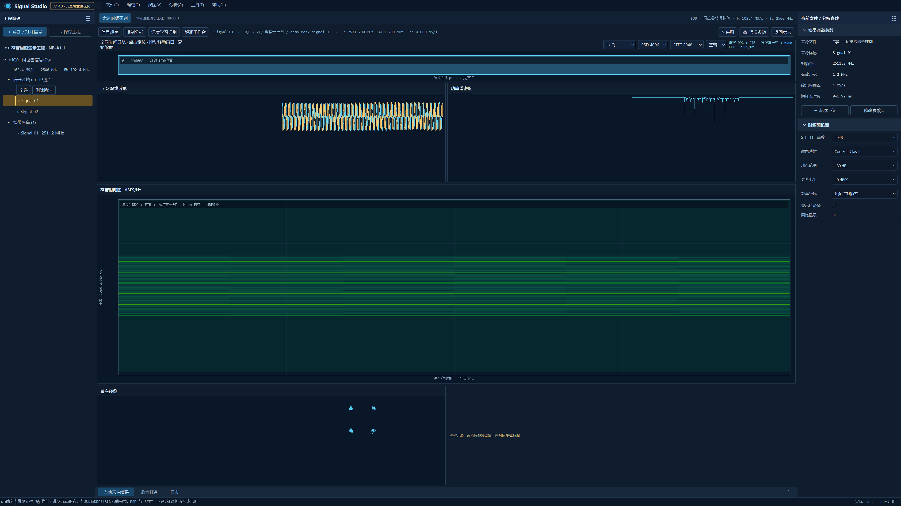

# 窄带通道验收记录

> 图谱回归更新（2026-10-10）：修复 GPU 曲线右偏、覆盖层丢失、绘图区裁剪及窄带 Esc 取消。Debug/Release 已重新构建，CTest 均 4/4，完整 UI 均 72/0/0，第二屏 D3D11 四页及波形/PSD 原生回归通过。此前 Debug 链接阻断已不适用于此次构建；详情见[本次修复及证据](chart-regression-2026-10-10.md)。下方 2026-10-09 的记录作为历史保留。

> 状态更新（2026-10-09）：Debug 与 Release 的宽带、窄带硬件烟测均有通过记录。目标屏为 Redmi 27 NU / `\\.\DISPLAY6` / 3840×2160 / DPR 1.5；四个窄带页均有 D3D11 数据绘制和可见窗口截图。最新资源清理后 Release 全目标构建及 CTest 4/4 通过；Debug 的强制重链接被本机 `MSPDB140.dll` 版本错误阻断（源文件编译完成，链接失败，错误在最小 MSVC 探针中复现）。此前 Debug 构建、CTest 和硬件烟测通过记录仍保留。最新验收补充见[图谱一致化记录](chart-rendering-followup.md)及[机器报告](chart-rendering-followup.json)。

## 覆盖范围

原生验收使用连接屏幕 2：友好名称 `Redmi 27 NU`，Windows 原生设备路径 `\\.\DISPLAY6`，3840×2160 物理像素、DPR 1.5、2560×1440 逻辑工作区。Debug 与 Release 均以对应输出目录中的可执行文件、Windows 平台和 system-only PATH 启动；Qt 插件及 CRT 从对应包目录加载。

最新图谱验收文件位于 [`chart-render-debug/`](chart-render-debug/)、[`chart-render-release/`](chart-render-release/)、[`wide-render-debug/`](wide-render-debug/) 和 [`wide-render-release/`](wide-render-release/)。每个目录含屏幕清单、机器报告和可见的 3840×2160 应用截图。四页窄带报告分别记录 GPU 数据 draw call（22、132、2、130）；窄带信号观察、调制分析、识别、解调页面在同一 D3D11 renderer 上完成帧呈现。早期 [`narrowband-debug-software/`](narrowband-debug-software/) 仍是单独的软件回退证据。

截图样例：

## 自动测试

仓库 CTest 分为 `signal_studio_core`、`signal_studio_channel_processor`、`signal_studio_display_sampling` 和 `signal_studio_ui`。通道处理测试覆盖正负频偏与源映射、三档 FIR 阻带目标、连续/分块 IQ 一致、16,384 输出样本跨块缓存一致性和命中、配置版本缓存隔离、I/Q/幅度/相位、PSD、STFT 与取消。UI 用例覆盖通道演示资源、四页切换、真实 DDC 状态、合成识别/阈值、眼图参数、工程往返和来源定位。

在本次 CMake 资源清理前，Debug、Release 全目标构建均成功，CTest 各为 4/4；两种配置的屏幕 2 硬件 smoke 均通过。清理后 Release 全目标重建和 CTest 仍通过（最新总耗时 21.02 秒）。Debug 最新重链接报 `LNK1101: MSPDB140.DLL` 版本不正确；此错误在最小编译/链接探针中复现，因而当前 Debug 重建未记为通过。全分辨率应用截图通过可见内容采样检查。机器汇总见 [`narrowband-final-report.json`](narrowband-final-report.json)；详细渲染数据见 [`chart-rendering-followup.json`](chart-rendering-followup.json)。

冻结原型清单的 12 个文件均已逐项核对大小和 SHA-256。不能用图像目录里的原型截图替代本工程测试结果。

## 交互验收矩阵

| 功能 | 当前状态 | 证据 / 边界 |
|---|---|---|
| 窄带演示工程、两个标记、一个通道、四页入口 | 已实现并通过 UI/原生烟测 | Debug/Release 四页报告 |
| 通道创建/编辑参数与工程树操作 | 已实现；全部级联弹窗未逐项原生验收 | [MainWindow](../../app/main_window.cpp) |
| 来源标记定位、删除关联通道确认 | 已实现；确认/取消组合未穷尽验收 | [MainWindow](../../app/main_window.cpp) |
| v2 工程存储、v1 迁移和精确 uint64 样本索引 | 已实现并通过 Core 测试 | [ProjectStore](../../infrastructure/project_store.cpp) |
| DDC、三档 FIR、有理重采样、PSD/STFT | 已实现并通过 DSP 测试 | [窄带处理器](../../infrastructure/channel_processor.cpp) |
| 16,384 IQ 块和 128 MiB LRU | 已实现并测试跨块一致、命中、版本隔离 | 不含独立的分析矩阵 LRU |
| 导航、时间缩放/平移/框选、PSD 频率与功率轴、STFT 联动 | 已实现共享缩放/平移/框选规则；窄带时间/频率/幅值与 PSD 功率范围按通道保存 | 当前四页 GPU 烟测通过；所有 wide/NB 手势组合尚未逐项录制 |
| RF/基带频率标签 | 已实现并测试工程往返 | 内部坐标始终为基带 Hz，标签按 Fc 换算 |
| 深度学习识别与位流工具 | 合成演示已实现 | 不执行真实模型、同步或解调 |
| 星座、眼图与星座框选/自适应缩放 | 星座和眼图 GPU 绘制已实现；框选与自适应缩放尚未完成 | 显示等比例；数据为合成示例 |
| 4K/150% 原生 D3D11 及 QWidget 软件回退 | Debug/Release 硬件渲染、四页切换、可见截图均通过；软件回退另有通过记录 | 目标为第二屏 3840×2160、DPR 1.5；详见图谱补充记录 |

## 未完成验收项

以下项目尚未达到完整实施计划的验收要求，当前结果不代表 NB-A1.1 全功能等价：

- 没有单独的 128 MiB PSD/STFT 矩阵 LRU、合并重叠请求队列或活动视图优先调度；IQ 块缓存为单工作区顺序访问，显示线程取消后同步 join。
- 部分图谱工作流仍未逐项验收：星座选区/自适应缩放、全部图表最大化/恢复，以及创建/编辑/关联删除弹窗的原生操作矩阵。
- 尚未执行与 SciPy 的逐点参考结果对照；尚未用本机 3.27 GB IQ 完成处理时间、缓存和内存压力记录。
- Debug/Release 截图用于四页切换与图形后端烟测；不能替代对全部弹窗、关联删除、取消、结果栏、缩放手势等逐项原生交互录像/截图矩阵。
- 识别和解调内容明确是合成展示，不是真实模型、同步或通信解调能力。
