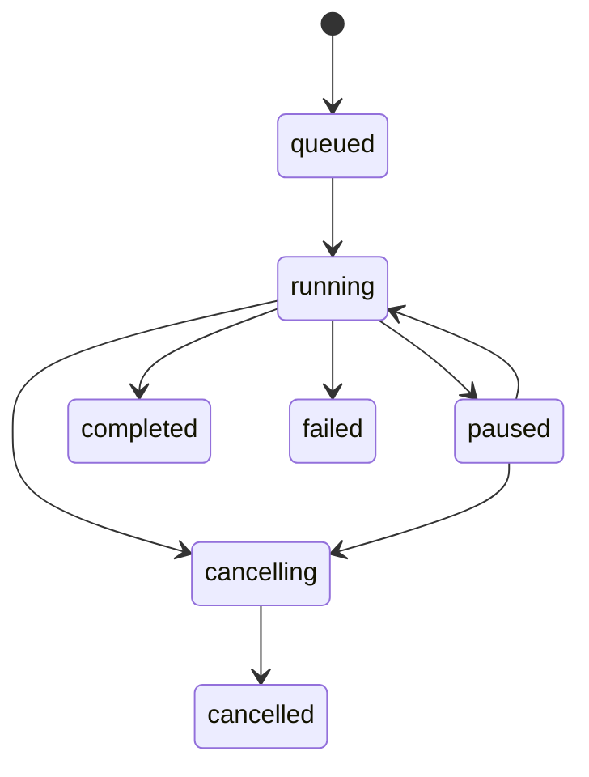

# 状态与异常场景说明

| 元数据项 | 内容 |
|---|---|
| 文档编号 | SS-UI-STATE-001 |
| 文档名称 | 状态与异常场景说明 |
| 项目名称 | Signal Studio / Signal Platform |
| 文档版本 | V1.0.0 |
| 基线版本 | BL1.0 |
| 状态 | 已批准 |
| 内容类型（meta.contentType） | Troubleshooting |
| 编制日期 | 2026-07-22 |
| 适用阶段 | 详细设计与测试 |
| 输入来源 | 术语契约、综合评审 |
| 本版变更 | 统一正交状态与异常目录 |

## 1. 正交状态

`ReadTaskState` 与 `DataSourceReadState` 独立：`cancelled + partial_ready` 是合法组合。`OverviewQuality`、`ResultValidity`、`ViewRequestQuality` 也不得复用任务状态枚举。

## 2. 异常目录

| 异常ID | 条件 | 用户语义 | 数据处理 | 恢复 |
|---|---|---|---|---|
| EX-DAT-001 | 文件尾非完整帧 | 样本帧对齐失败 | 不发布未校验尾部 | 修改格式或使用完整前缀 |
| EX-DAT-002 | 源文件变化 | 数据源版本过期 | 缓存/结果标 stale | 重验证或新建版本 |
| EX-CACHE-001 | 磁盘满/瓦片损坏 | 缓存降级 | 源文件与项目不变 | 清理/换目录/按需计算 |
| EX-COMPUTE-001 | GPU 不可用 | 回退 CPU | 记录实际后端 | 重新探测设备 |
| EX-PLG-001 | 插件崩溃/不兼容 | 隔离并拒绝加载 | 不提交结果 | 安全模式/升级插件 |
| EX-MODEL-001 | 模型输入不兼容 | 不适用 | 不运行推理 | 选择兼容模型/前处理 |
| EX-PROV-001 | 来源键不一致 | 阻止分析 | 不显示为当前对象 | 刷新上下文/诊断 |
| EX-TASK-001 | 依赖失败/取消 | 依赖失败 | 不发布半成品 | 修复依赖后重试 |

所有异常映射稳定 ERR 码，含用户消息、技术详情、建议、TaskId、DataSourceVersionId。

## 参考资料

- 原始材料：`../references/`（交付目录之外，只读输入）
- 平台任务提示词（平台化架构版）

## 未决事项

- 无阻断性未决事项；正文中的建议值和待确认项继续按其原状态追踪，不因文档获批而视为已实施。

## 变更记录

| 版本 | 日期 | 变更 |
|---|---|---|
| V1.0.0 | 2026-07-22 | 建立并自动审核通过平台化开发基线，纳入需求、接口、测试和复用边界。 |
