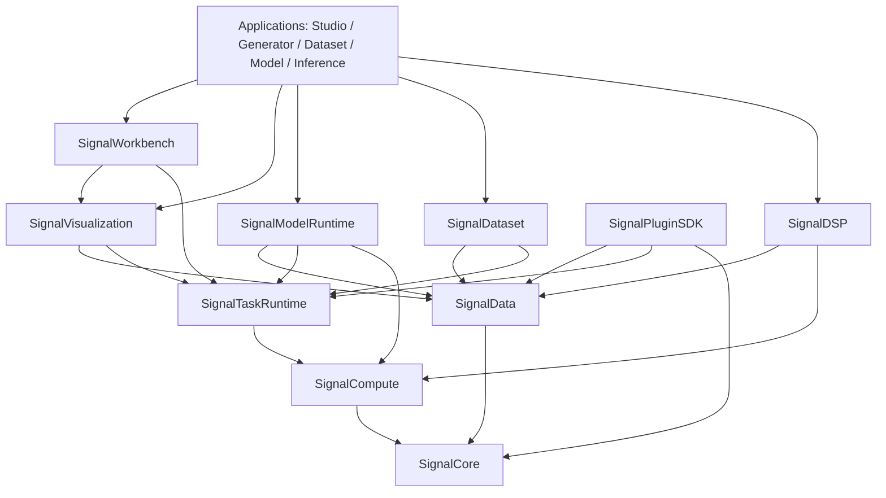

# 软件总体架构设计说明书

| 元数据项 | 内容 |
|---|---|
| 文档编号 | SS-ARCH-001 |
| 文档名称 | 软件总体架构设计说明书 |
| 项目名称 | Signal Studio / Signal Platform |
| 文档版本 | V1.0.0 |
| 基线版本 | BL1.0 |
| 状态 | 已批准 |
| 内容类型（meta.contentType） | Conceptual |
| 编制日期 | 2026-07-22 |
| 适用阶段 | 架构至发布 |
| 输入来源 | 平台总任务、SRS、术语契约 |
| 本版变更 | 建立可复用平台为最高优先级 |

## 1. 架构结论

采用 **Monorepo + CMake targets + vcpkg manifest + 混合链接**。十个公共模块先于应用建设；Signal Studio 位于 `apps/signal-studio`，只编排公开服务。普通 C++ 库以隐藏符号/PIMPL 的共享库发布，性能敏感模板放开发包；插件边界使用版本化 C ABI，C++ wrapper 仅为便利层。

```text
apps/{signal-studio,signal-generator,dataset-manager,model-trainer,inference-studio}
libs/{signal-core,signal-data,signal-dsp,signal-compute,signal-task-runtime,
      signal-visualization,signal-workbench,signal-plugin-sdk,signal-model-runtime,signal-dataset}
plugins/{importers,exporters,algorithms,models,visualizations}
tests/{unit,integration,performance,compatibility,golden-data}
```

## 2. 分层与依赖



允许方向与 `architecture.json` 一致。Core 不依赖 Qt Widgets；DSP/Data 不依赖页面；UI 不直接操作文件句柄；应用不调用 oneMKL/cuFFT/ONNX Runtime。CI 对 DAG 做循环检测，并扫描公共签名的第三方类型。

## 3. CMake 与包

公开 targets：`Signal::Core`、`Signal::Data`、`Signal::Compute`、`Signal::DSP`、`Signal::TaskRuntime`、`Signal::Visualization`、`Signal::Workbench`、`Signal::PluginSDK`、`Signal::ModelRuntime`、`Signal::Dataset`。每个包包含 runtime/dev/debug symbols/licenses/SBOM；包消费者测试使用 `find_package(SignalPlatform 1 CONFIG REQUIRED)`。

## 4. API、ABI 与版本

公共头文件位于 `include/signal/<module>`，私有实现位于 `src`。导出类用 PIMPL，异常不跨 ABI；插件以 `signal_plugin_query_v1` 交换 POD 与函数表。SDK、schema、插件 ABI、应用独立 SemVer；弃用至少跨一个次版本并在编译/运行日志提示。

## 5. 第三方适配

FFT 默认 oneMKL，CUDA/cuFFT 为可选后端；FFTW 仅许可兼容构建。Eigen、TBB、HDF5、ONNX Runtime、spdlog、fmt、GoogleTest、Google Benchmark 仅出现在私有适配器/测试中。上层只见平台类型。Qt 图形方案需经许可证和百万点/时频瓦片基准后冻结。

## 6. 测试边界

每个模块独立单测；相邻模块契约测试；适配器黄金数据和 CPU/GPU 一致性；包消费/ABI/API/插件兼容；第二宿主复用；应用 E2E。公共测试禁止通过 Signal Studio 私有 UI 驱动。

## 参考资料

- 原始材料：`../references/`（交付目录之外，只读输入）
- 平台任务提示词（平台化架构版）

## 未决事项

- Qt 图表实现、插件进程隔离默认级别和二进制签名方案待 MS-00 基准/安全评审冻结。

## 变更记录

| 版本 | 日期 | 变更 |
|---|---|---|
| V1.0.0 | 2026-07-22 | 建立并自动审核通过平台化开发基线，纳入需求、接口、测试和复用边界。 |
