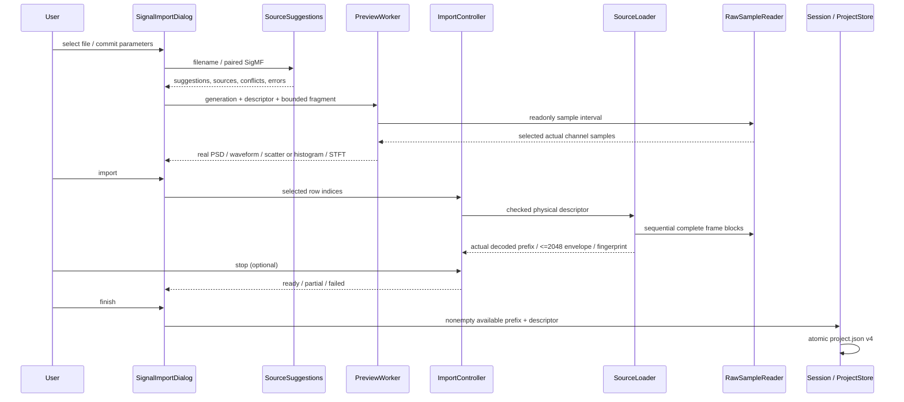
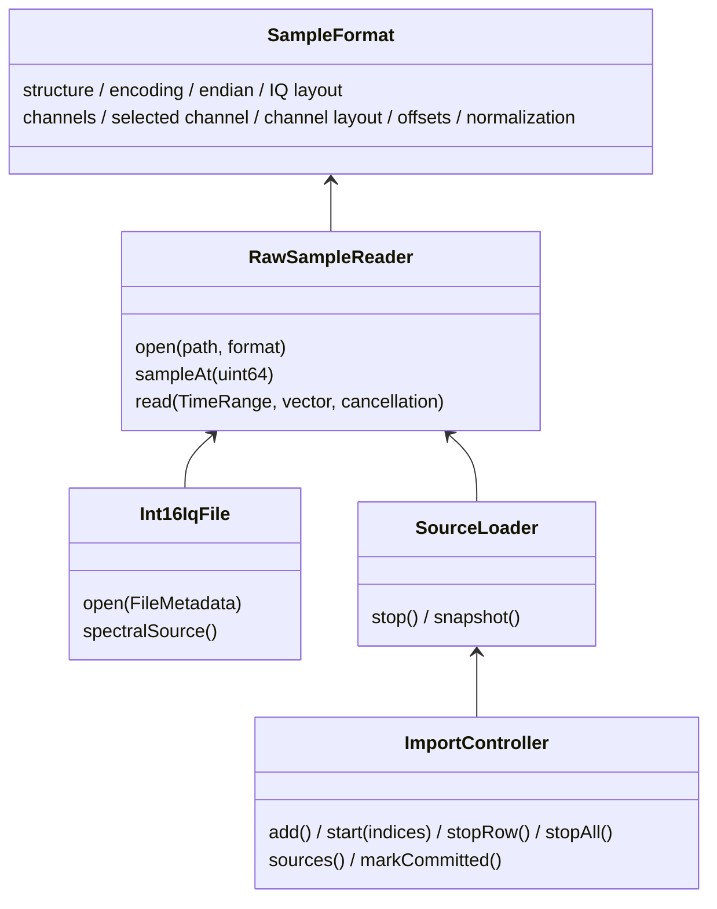
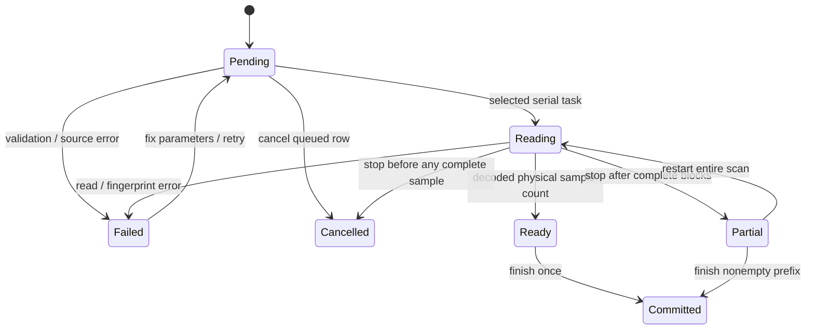

# Import Architecture

## Data Flow

## Interfaces

格式验证器是唯一派生来源；Int16IqFile名称保留供旧API使用，metadata入口按实际format解释，不按类名猜编码。Raw reader随机条件映射，分析read使用有界真实QFile读取；每次磁盘/解码预算32MiB，取消至少每1024样本。SourceLoader块接近4MiB且整帧，无源文件写入。

Planar IQ + TimeInterleaved：全局I帧区域后全局Q帧区域，每区通道交织。Planar IQ + ChannelPlanar：每通道先全部I、后全部Q，再下一通道。IQ/QI + ChannelPlanar：每通道连续复样本；其它按时刻连续各通道。144矩阵夹具独立循环编码验证地址与实际读取。

## Partial State

每行源句柄在任务结束释放；后续行不影响已成功行。错误行不产生工程节点；部分成功提交回调失效时已提交行标记，重试不重复添加。预览context切换撤销草稿，旧请求用generation拒收；工程切换沿用原始业务取消与图谱generation机制。

## Priority / Migration

用户本文件已提交字段 > 可信SigMF可用字段 > 明确文件名字段 > 选定模板 > 未确认默认值。来源/冲突展示在采集参数和校验区；不同SigMF/手动格式被模板覆盖前确认。未知SigMF错误保留为metadataError，不被后续RAW基础校验抹去。Fc=0有效，缺失Fs/Fc/format需人工确认。

v4存储完整sampleFormat，header/trailer与所有样本索引为uint64十进制字符串；v1/2/3恢复CI16/LE/IQ/单通道/零偏移。保存QSaveFile原子提交；导入先完整校验，再替换Session。运行reader、worker、图谱片段和缓存不落盘。source availability保留物理长度与已读前缀、大小/修改时间指纹；重开不将未读尾部当可用数据。

缓存身份包含源路径/大小/修改时间、完整sampleFormat（含选中通道/偏移/归一化）、Fs/Fc、可用前缀及源generation；PSD和STFT参数独立加入各自key。旧CI16归一化1/32768保持不变。UInt8先减128，整数按128/32768/2^31可选归一化，浮点保留原值。实数使用0..Fs/2单边功率（非DC/Nyquist×2），Fc只是参考，不加到实数谱轴。
