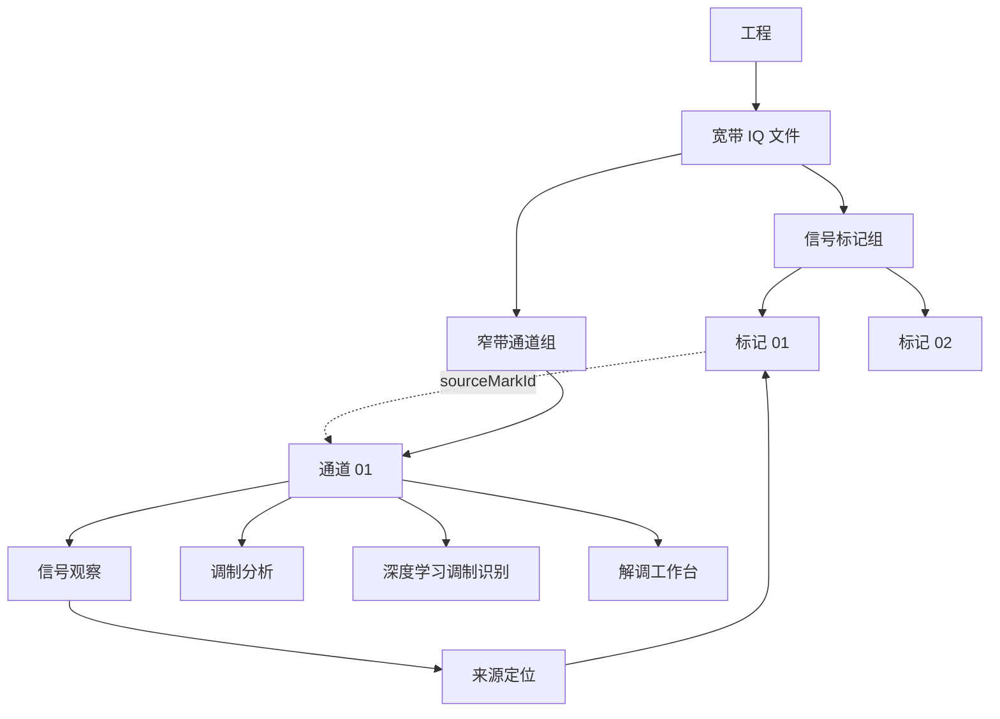
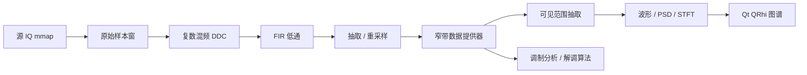
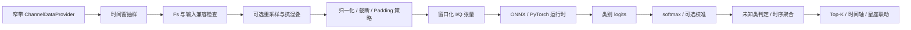

# Signal Studio · 窄带通道与分析工作区交互设计规范

> 设计编号：NB-A1.1（评审草案；在 NB-A1.0 基础上新增深度学习调制识别）  
> 日期：2026-10-09  
> 依据：`yulongpo/signal_studio` 分支 `rebuild/a143-native`；基线 `docs/prototype/a1.4.3/`  
> 设计状态：**前端交互原型；并非已实现的 Qt/DSP 功能**

## 1. 设计定位与基线核查

目标：在已有宽带文件预览、时频图标记与标记编辑之上，增加“标记 → 窄带通道 → 窄带分析 → 来源回溯”的完整交互链，并保证宽带/窄带的物理时间、RF 频率语义一致。

分支中已存在：

- 基于 Qt 6.11.1 Widgets / C++20 / QRhi 的宽带分析界面与图谱渲染；源文件 int16 交替 IQ 只读 mmap。
- 工程树中的信号标记、多选、编辑、删除、联动与视图历史；`Channel` 模型具有 `id/name/sourceMarkId/centerFrequencyHz/bandwidthHz`。
- `Session::createChannelFromActiveMark()` 根据源标记中心与带宽增加演示通道记录，尚不执行 DDC。
- 删除源标记时会级联删除引用它的演示通道；修改标记并不会自动更新已创建通道。

本设计**新增**：通道创建及编辑对话框、采样率/滤波参数、通道状态、窄带数据上下文、内部切换工作区、星座/眼图/解调入口，以及 NB-A1.1 的深度学习调制识别工作区。

### 范围边界

- **本版 HTML 演示实际可操作**：工程树切换、宽带标记选择与新增、创建/修改窄带通道、参数基础校验、来源定位、全局时间导航、时域/时频视图联动、FFT/调色板开关、分析模式切换、结果区折叠与日志展示。
- **原型模拟而非实际运算**：IQ 波形、PSD、时频图、星座图、眼图、示例解调位流。它们用于 UI 验证，不来自输入文件或 DDC；深度学习识别支持生成明确标注为模拟的演示预测与得分；解调按钮仍为占位。
- **需要后续 Qt + DSP 实现**：混频、FIR 抗混叠、分数/整数重采样、输出基带 IQ、PSD/STFT 真值、定时/载波恢复、真实调制识别模型推理、解调、工程持久化与真实后台任务状态。

## 2. 主要产品决策

| 决策项 | NB-A1.0 建议 | 理由 |
|---|---|---|
| 窄带工作区形态 | 与宽带共用主窗口、工程树和结果栏，工作区用标签切换 | 保留上下文；无需另开应用窗口 |
| 通道生成入口 | 宽带标记工具条、标记右键菜单、工程树快捷操作 | 路径清晰、易被发现，沿用既有 A1.4.3 标记工作流 |
| “通道”与“源标记” | **创建时快照** + 持久化 `sourceMarkId` | 修改源标记不应默默重新计算已经提取的 IQ |
| 默认时间范围 | **源标记时间段**；用户可选源文件全时长 | 避免无意义的大文件全量提取；支持连续信号分析 |
| 默认频率坐标 | 窄带频谱、时频图 **基带相对频率（0 Hz 中心）**；可切换 RF 绝对频率 | 符合 DDC 后分析习惯；RF 坐标可回溯 |
| 时间坐标 | 默认保持源文件绝对时间 | 跨宽带/窄带定位时无时基跳跃 |
| 默认主要视图 | **信号观察**：导航条、波形与 PSD、时频图与星座预览 | 从低门槛观察开始，逐步进入调制和解调 |
| 进阶视图 | “调制分析”“深度学习识别”“解调工作台” | 允许扩展高级算法面板而不过度挤占默认空间 |
| 大文件处理 | 以块/窗口进行后台 DDC 和可见区域抽取 | 避免复制全部 IQ 到内存；保证交互优先 |
| 删除依赖 | 删除源标记时显示所影响的通道列表，要求确认 | 与当前级联语义兼容，但降低误删风险 |

## 3. 信息架构与布局



**主窗口三列**：左侧工程树 228 px；中部主要工作区；右侧分析参数 286 px（与 A1.4.3 色值、分隔方式一致）。顶部菜单、工具栏和工作区标签保留；底部结果栏默认收起。

### 3.1 信号观察（默认）

```
┌───────────────────── 工程树 ───┬──────────────── 主工作区 ─────────────────────┬── 属性 ─────────┐
│ IQ 文件                         │ 标签：宽带 IQ0 | 窄带 通道01                      │ 通道来源        │
│ ├─ 标记                         ├───────────────────────────────────────────────┤ RF 中心         │
│ └─ 窄带通道                     │ 通道路径 / 回源 / 修改参数                     │ BW / Fs'        │
│   ├─ 通道01                     │ 信号观察 / 调制分析 / 解调工作台             │ 时域/PSD 参数   │
│   └─ 通道02                     ├──── 全局时间导航（源文件时间轴） ─────────────┤ FFT / 调色板    │
│                                 ├──────── 时域波形 ───────┬──── PSD ────────────┤ 识别/解调接口   │
│                                 ├────────── 时频图 ───────┼──── 星座预览 ───────┤                 │
│                                 ├──── 光标 / 时间范围 / 采样率状态 ─────────────┤                 │
│                                 └──── 当前结果 | 任务 | 日志（可展开）──────────┘                 │
└─────────────────────────────────────────────────────────────────────────────────────────────────┘
```

### 3.2 调制分析

采用星座图与眼图等高优先视图，以下方时频图和参数卡片补充。后续支持载波同步、定时同步、符号率估计、调制识别（推理结果应携带模型名称/版本/置信度定义）。

### 3.3 解调工作台

采用同步后星座与眼图、比特/软判决及帧结果区域。输出应显示解调参数、码元率、同步状态、校验/帧标识与失败原因。**不可将占位位流当成真实解调结果。**

## 4. 创建窄带通道流程

1. 先选择当前宽带文件的一个有效标记（多个标记选中时需要选择一个来源，不能隐式批量处理）。
2. 从图谱底部/右键菜单/工程树/工具栏打开“创建窄带通道”对话框。
3. 自动继承源标记的 RF 频率中心、带宽和时间范围；可编辑中心/通道带宽/输出采样率/提取时间范围/滤波器策略。
4. 输入校验通过，创建通道记录并建立后台 DDC 任务；可选“创建后打开”。真实 Qt 工作区在任务未完成时展示待处理/处理中/失败或取消状态，不应展示虚构计算结果。
5. 后台任务完成后通道变为 Ready，按需加载可视窗口数据，绘制真实图谱。
6. 在窄带工作区点击“⌖ 来源定位”回到对应宽带文件、选中源标记并将其纳入可视范围；可从通道标签返回继续分析。

### 4.1 表单字段

| 字段 | 默认值 | 建议校验与行为 |
|---|---|---|
| 通道名称 | `窄带通道 NN` | 非空，UTF-8，最多 80 字符；工程内推荐唯一 |
| 来源标记 | 当前活动标记 | 标记 ID 必须存在且属于同一源文件 |
| RF 中心频率 | `(f0 + f1)/2` | 必须落在源文件有效 Nyquist 频带内 |
| 通道带宽 | `f1 - f0` | `B > 0`，不得越过输入可处理频带；可加保护带 |
| 输出采样率 `Fs'` | 根据带宽推荐档位 | 校验 `Fs' ≥ B + 2 Δf`，支持整数抽取及有理数重采样 |
| 处理时段 | 标记 `t0…t1` | 也可选源文件全长，存成原始半开样本区间 |
| 滤波器配置 | `FIR 标准` | 实际截止、过渡带、阻带衰减由算法模块明确给出 |
| 保留源时间映射 | 默认开 | 窄带输出保留 `sourceSampleBegin` 与源时钟映射 |
| 创建后打开 | 默认开 | 后台任务未就绪时先展示占位状态 |

**输出采样率技术约束**：仅满足奈奎斯特 `Fs' ≥ B` 通常不足以设计足够的抗混叠过渡带。应按实际 FIR 的保护带 `Δf` 计算 `Fs' ≥ B + 2Δf`；原型暂用 `Fs' ≥ 1.3 B` 的简化可视校验，不得硬编码进最终 DSP。

### 4.2 异常与编辑

- 中心与带宽使通道超出输入可用频带：红色字段提示，禁用提交。
- 输入/输出 Fs 不可形成支持的重采样比：提示建议 Fs' 和处理代价，而非静默选择不同 Fs'。
- 源文件丢失：通道可保持配置信息与结果元数据，状态变为 SourceMissing，不显示有效实时 IQ。
- 处理期间取消：恢复到可重试状态，不能保留未完成结果作为 Ready。
- 修改通道参数：保留旧参数直到确认，确认后使旧图谱缓存失效并重新处理，需明确告知耗时。
- 修改原始标记：默认**不自动**改变已经存在的通道快照；可提供“根据源标记更新并重新提取”显式动作。
- 删除关联源标记：沿用当前级联删除语义，但增加确认对话框，明确列出受影响通道数、当前打开通道和是否删除计算缓存。

## 5. 物理坐标与图谱交互

| 视图 | X / Y 坐标 | 鼠标默认行为 | 联动 |
|---|---|---|---|
| 全局时间导航 | X = 源文件时间 | 点击跳转；蓝色范围拖动平移；滚轮缩放时间窗 | 与波形/时频图当前时间一致 |
| 窄带波形 | X = 源时间，Y = I/Q/幅度/相位 | 图内滚轮只缩放时间；框选时间范围；光标测量 | 与导航与时频图时间同步 |
| PSD | X = 基带相对频率（或 RF 频率），Y = dBFS | 图内滚轮缩放频率；左侧 Y 轴滚轮缩放功率 | 与时频图频率轴同步 |
| 窄带时频图 | X = 源时间，Y = 基带频率 | 图内滚轮缩放时间；左侧 Y 轴缩放频带；拖动框选 | 时间与波形、频率与 PSD 联动 |
| 星座图 | X = I，Y = Q | 等比例缩放；框选点集；重置视图 | 响应统一时间选择与恢复数据状态 |
| 眼图 | X = 符号周期，Y = I/Q 幅度 | 切换分量、叠加周期、分析窗口 | 与同步算法的符号采样关联 |
| 解调位流 | X = 序列索引/时间 | 点击位定位源时间；选择复制/导出 | 回链源 IQ 的样本范围 |

注意：HTML 演示只实现部分上述交互（主波形/窄带时频时间滚轮、时频框选、导航、模式切换等）；表中更完整的轴交互是正式 Qt 目标规范。

时间索引以原始 `uint64_t` `SampleIndex` 为权威，保留半开区间 `[begin,end)`：

\[
 t = n / F_{s,\mathrm{source}}, \qquad f_{\mathrm{RF}}=f_{c,\mathrm{channel}}+f_{\mathrm{BB}}
\]

窄带输出样本索引应通过时间映射、重采样比和滤波器群时延确定相应原始源索引。**不应该仅用浮点秒乘采样率往返推算大文件的索引**，以免发生精度漂移。若采用线性相位 FIR，需要保存或补偿群时延。

### 5.1 图谱默认显示

- 信号观察：波形 I/Q 双色线 + PSD；下方主窄带时频图和小星座预览。
- PSD FFT 默认 4096，STFT FFT 默认 2048，与当前分支配置习惯保持接近。
- 颜色映射沿用 `Turbo`、`CoolEdit Classic` 等已有枚举与主题；图内以基带频率中心 0 Hz 为默认。
- 星座图必须保持正方形 **I/Q 相同单位比例**。算法未同步时不应误把原始 IQ 点云解释为已稳定锁定的调制星座。
- 全局时间导航始终存在，窄带时间窗受该通道提取时间范围约束；来自全文件的通道可浏览全文件。
- 结果栏默认收起，必要时展开“通道结果 / 后台任务 / 日志”，避免占用主要图谱空间。

## 6. 数据与状态模型建议

现有 `domain/project.h::Channel`：

```cpp
struct Channel {
    std::string id;
    std::string name;
    std::string sourceMarkId;
    double centerFrequencyHz = 0;
    double bandwidthHz = 0;
};
```

建议扩展或聚合为（**概念字段，不是已存在代码**）：

```cpp
enum class ChannelState {
    Configured, Queued, Processing, Ready,
    Failed, Cancelled, SourceMissing, Stale
};

struct ChannelConfig {
    std::string id, name;
    std::string sourceFileId, sourceMarkId;
    TimeRange sourceSampleRange;            // [begin, end) in source IQ
    FrequencyRange sourceMarkedFrequency;  // snapshot, RF Hz
    double rfCenterHz = 0;
    double occupiedBandwidthHz = 0;
    double outputSampleRateHz = 0;
    double passbandHz = 0;
    double transitionBandwidthHz = 0;
    double stopbandAttenuationDb = 0;
    bool preserveSourceTime = true;
    std::string filterPreset;
    ChannelState state = ChannelState::Configured;
};

struct ChannelViewState {
    std::string channelId;
    TimeRange visibleSourceTime;
    FrequencyRange visibleBasebandFrequency;
    int psdFft = 4096;
    int stftFft = 2048;
    // I/Q mode, palette, grid, dynamic range, zoom histories ...
};
```

`ChannelConfig` 是计算语义快照；`ChannelViewState` 是显示偏好。算法产生的数据句柄、缓存以及处理任务 ID 应由独立 runtime/session 层管理，不能将完整 IQ 放进工程 JSON。通道配置/版本/源引用需要可序列化；渲染缓存可丢弃并重建。

### 6.1 数据链路



DDC 示意（整数抽取时）：

\[
 y[m] = \left.\left( h[n] * \left[x[n] e^{-j2\pi (f_{c,\mathrm{channel}}-f_{c,\mathrm{source}})n/F_{s,\mathrm{source}}}\right] \right)\right|_{n=mM}
\]

其中 `M` 为整数抽取因子；非整数采样率比需要有理数/多相重采样实现，不能简单 `n=mM`。

## 7. Qt 工程映射与建议模块

| 当前模块 | NB-A1.0 建议增量 |
|---|---|
| `domain/project.h` | Channel 配置/来源时间快照/状态与可序列化元数据 |
| `application/session.*` | 通道创建/修改/删除、来源定位、活动通道、独立历史与分析视图状态 |
| `infrastructure/` | 异步 ChannelDataProvider、DSP DDC、FIR、重采样、缓存读取接口 |
| `app/main_window.*` | 工作区 tab、通道配置 dialog、参数面板、任务与状态绑定 |
| `ui/charts/` | 窄带波形/PSD/STFT、等比例星座、眼图、比特视图、时频联动 |
| `tests/` | 参数边界、数据映射、资源生命周期、异步取消、绘图交互、工程往返 |

复用现有 `PlotWidget` 坐标/手势/渲染框架；避免将数值 DSP 计算放入 QWidget/QRhi 渲染线程。后台任务使用 request generation / cancel token，GPU 纹理或 QPainter 覆盖层更新应复用已有宽带分级抽取策略。

### 7.1 数据吞吐与缓存建议

- 文件级 mmap + 分块基带处理；显示层只申请可见时间区段所需的抽取与 PSD/STFT 数据。
- 对跨块 FIR 的滤波器状态、相位连续性、时间戳/群延迟进行专门测试。
- 将 **提取原始数据**、**分析显示矩阵**、**图像颜色映射**、**覆盖层**分开缓存；修改颜色不重算 DSP。
- “源标记快照/通道配置版本/输入文件指纹”参与缓存键，防止旧结果误复用。
- 大文件选择全时长时，预估计算成本并提供取消与后台运行，不阻塞 UI 交互。

## 8. 验收场景（建议）

| 编号 | 验收点 | 预期 |
|---|---|---|
| NB-01 | 宽带标记 → 创建通道 | 自动继承来源频率/时间；可修改参数；通道出现工程树 |
| NB-02 | Fs' 与 BW 不满足滤波约束 | 阻止提交并指出原因，保证最终 DSP 的 guard 与 UI 一致 |
| NB-03 | 创建后切换窄带工作页 | 工作区显示通道来源、时基、采样率、各图谱入口 |
| NB-04 | 全局时间导航 + 波形 + STFT | 缩放/平移/选区以源时间同步；连续手势合并历史 |
| NB-05 | 基带/射频坐标切换 | 图谱频率数值变换正确；业务数据不改变 |
| NB-06 | PSD/STFT 参数切换 | 重算对应显示矩阵；不改变通道 IQ 及源标记 |
| NB-07 | 星座图 | I/Q 方形等比例；跟随当前分析时间窗 |
| NB-08 | 切换调制/解调布局 | 窄带通道、时间范围、显示参数不丢失 |
| NB-09 | 来源定位 | 回到正确源文件的正确标记，不影响已提取数据 |
| NB-10 | 删除标记 | 列出受影响通道并二次确认，取消后零业务状态改变 |
| NB-11 | 源标记改变 | 已有通道快照不暗中变化；显式更新才重算 |
| NB-12 | 工程保存/重启 | 配置、状态与来源映射恢复；不存在原始 IQ 内嵌 |
| NB-13 | 大样本索引 | 超过 `2^53` 仍按 `uint64_t` 保持精确，物理时间标签无漂移 |
| NB-14 | 4K / 150% DPI | 按当前分支约定在物理 3840×2160、150% 下验证 Qt 布局；不能用浏览器截图替代 |
| NB-15 | 后台取消/失效 | 切页/改参数/关闭工程无悬空回调或过期结果覆盖 |
| NB-16 | 全文件/标记时间段 | 两种提取模式分别映射到正确源样本区间 |

## 9. 分期落地建议

**NB-M1（先闭环）**：通道参数对话框；扩充持久化模型；真实 DDC + FIR + 分块重采样；源文件时间映射；窄带波形、PSD、STFT；来源定位。以可用的真实 IQ 计算为完成条件。

**NB-M2（精细分析）**：星座/眼图，I/Q 波形多模式，符号率与同步算法接口，PSD/STFT 显示性能优化，结果联动。

**NB-M3（智能处理）**：ONNX/PyTorch 模型运行时、真实 IQ 调制识别推理、解调/软比特/帧结果、算法调试参数、批量处理和导出。

## 10. 原型文件与运行

- `Signal_Studio_Narrowband_Prototype_A1.1_DL.html`：单文件 HTML/CSS/JS，无 CDN 或依赖；双击本地浏览器打开。
- `narrowband_observe_preview.png`：窄带默认视图截图。
- `narrowband_modulation_preview.png`：调制分析视图截图。
- `wideband_link_preview.png`：宽带来源及标记入口截图。
- 图谱和本版深度学习识别演示输出均为前端生成的**合成模拟数据**，不读真实 IQ，不需要 Qt 或构建环境。
- 本次仅在独立交付目录提供文件，**未提交或修改 GitHub 分支**。

**待产品确认的重要问题**：窄带通道的默认提取时间是否始终使用标记范围（本稿采用）、是否需要同一通道支持多个不连续时间片，以及后续是否允许脱离原文件保存独立窄带 IQ。这些影响通道模型与数据缓存策略，应在 NB-M1 前冻结。


---

## 11. NB-A1.1 新增：深度学习模型调制识别

### 11.1 产品定位与入口

在**窄带通道工作区**的分析视图栏新增独立的 **“深度学习识别”** 标签，与“信号观察 / 调制分析 / 解调工作台”并列。传统“调制分析”仍承担星座图、眼图、同步参数观察；不应将深度学习分类器的结果作为已经完成符号同步或解调的证明。

- 入口 1：打开窄带通道 → 点击“深度学习识别”。
- 入口 2：“调制分析” → “打开深度学习识别”。
- 返回：“查看星座图”将选中的识别片段定位到窄带时间窗并切换调制分析工作页。
- 与宽带联动：模型结果始终保存 `sourceFileId` / `channelId` / `sourceMarkId` 与原始样本时间映射；既有“来源定位”仍从通道回到宽带标记。
- **本版边界**：预设模型仅为 manifest/UI 示例，无网络、无模型权重、无文件 IQ、无实际算法推理。预测分数系合成数据，仅验证状态机与可视化布局。

### 11.2 页面分区

| 区域 | 内容 | 操作 |
|---|---|---|
| 左侧推理配置 | 模型选择、配置档案、输入范围、幅度预处理、滑窗点数、重叠率、推理设备、重采样兼容、未知类阈值 | 校验、运行演示任务、取消任务 |
| 顶部统计卡片 | 当前片段分类、Top-1 分数、当前运行范围、运行状态 | 随片段选择更新 |
| 类别排名 | Top-5 原始模型分数或后处理分数，水平条形图 | 标签按分数降序；低分输出未知 |
| 可追溯信息 | 来源通道、配置版本、输入 Tensor、推理设备、模型哈希 | 导出演示 JSON，包含 synthetic 标志 |
| 分段识别时间轴 | 由滑窗预测按时间汇总的类别轨道 | 单击片段 → 更换详情、显示时间范围；定位按钮跳转 |
| 片段时频图 | 相对频率 / 绝对源时间；选中片段覆盖显示 | 点击“查看星座图”进入对应时间区段 |
| 模型管理弹窗 | 模型列表、格式、输入张量、期望采样率、预处理条件、权重状态 | 选中模型配置；文件选择仅为占位，不执行加载 |

### 11.3 模型清单与配置约束

内置 **3 个 UI 模板**：`RF-ResNet18 · IQ`、`CLDNN · IQ`、`IQ-Transformer`，**均不是已训练/已注册模型，也不暗示其真实性能或准确率**。正式实现使用用户提供的 `ONNX` / `PyTorch` 模型与配套 manifest 注册。

最小 manifest 建议字段：

```json
{
  "model_id": "my_rf_classifier",
  "model_version": "1.0.0",
  "framework": "onnx",
  "model_uri": "models/my_rf_classifier/model.onnx",
  "sha256": "<实际校验时填写 SHA-256>",
  "input": {
    "tensor_name": "iq",
    "shape": [null, 2, 2048],
    "layout": "NCL",
    "dtype": "float32",
    "iq_mapping": ["I", "Q"],
    "sample_rate_hz": 4000000,
    "normalization": "rms"
  },
  "output": {
    "tensor_name": "logits",
    "type": "multiclass_logits",
    "labels": ["BPSK", "QPSK", "8PSK", "16QAM", "2FSK", "GMSK", "OFDM", "AM", "FM"]
  },
  "calibration": null
}
```

注意：`shape` 中 `null` 表示可变批次，不代表推理服务必须支持动态批次。推理启动前应严格校验模型实际 I/O、类别数与 manifest 一致。自定义模型目录不得仅凭扩展名默认可信，不应在 GUI 线程执行任意 Python 模型加载代码。

### 11.4 窄带 IQ 到模型的处理链



- **输入源**：必须使用真实 DDC / FIR / 重采样输出的**复数基带 IQ**，不能将时频图像贴图、PSD 向量或浏览器合成波形冒充 IQ 分类模型输入。例外是模型 manifest 明确要求时频图张量，并具有对应独立预处理器。
- **时间语义**：业务区间使用原始文件 `uint64_t` 样本索引 `[begin,end)`；窄带输出样本索引通过有理采样率映射回源时间。需正确补偿滤波群延迟、跨块状态和缓冲对齐，显示时间不能靠浮点秒数累加产生长期漂移。
- **采样率**：模型 manifest 的期望采样率与通道输出 `Fs` 不一致时，禁止静默直接推理。用户可显式选择合理重采样链，并检查有效带宽与 Nyquist 约束。上采样不会恢复已经丢失的信息；仅更改数据点数更不能被视为频谱修复。
- **标准化**：`RMS`、按通道 I/Q 的 `z-score` 与无归一化模式，其均值/方差统计范围、零能量行为、处理顺序必须与模型训练配置一致。
- **窗口分割**：典型配置 `L=2048/4096`、重叠 50%，批处理由运行时决定；`N` 个窗口对应的源样本区间必须可追溯。不足一帧时禁用运行或明确 Padding 规则，尾部残帧按模型要求处理。
- **结果计算**：单标签分类采用 `argmax(logits)`，必要时 `softmax(logits)` 显示类别分数。未校准 softmax **不等于识别正确率或可信置信区间**。多标签模型需要独立 `sigmoid`/阈值分支，不能混用单分类结果渲染。
- **低置信与未知**：Top-1 分数低于可调整阈值时返回“未知/需复核”；真正的开放集识别还需 OOD 检测或专门的 reject calibration，阈值本身无法保证识别未知信号能力。
- **聚合粒度**：展示的彩色时间段是多个滑窗输出的**聚合段**，不是每个颜色块只做一次 2048 点推理。Qt 版本需定义 majority vote / 均值 logits / 加权置信与最小时长、抖动抑制策略。

### 11.5 模型状态机、异常与取消

建议状态：

`NotRegistered → Validating → Ready → Queued → Running → Completed`；可旁路进入 `Invalid / Failed / Cancelled / Stale / SourceMissing`。

- **校验失败**：模型缺失、哈希不一致、输入 shape 不匹配、标签数冲突、重采样不支持、输出 NaN/Inf、IQ 不足一帧时禁止推理，并在左栏给出具体原因。
- **异步生命周期**：配置变动或重开通道时，当前任务使用 generation ID / cancel token 取消；迟到输出不得覆盖新任务 UI。用户切换分析页不必取消已提交的后台任务，但关闭工程或数据源失效必须处理资源释放。
- **模型与参数变更**：已有结果保留快照并标明 `Stale`，支持显式重跑。阈值变化可只重算判定 UI，不需要重跑模型；预处理、模型、时间窗、通道 Fs 更改须使推理缓存失效。
- **CPU/GPU**：目标可设计为 `Auto / CPU / CUDA / DirectML（Windows 可选）`，真正可选项由 runtime 枚举的 Execution Providers 决定；GPU 不可用时按用户策略提示或回退，不能仅因菜单选择“GPU”就声明已经使用 GPU。
- **结果来源**：用户不能混淆 `Simulated`、`Actual` 和 `Cached-Stale` 三种状态。真实数据路径、模型哈希、运行设备和运行耗时只能由后端实际报告，不在原型中编造。

### 11.6 建议领域/应用接口（概念草案）

```cpp
struct ModulationModelInfo {
    std::string id, version, sha256;
    std::string framework, deviceProvider;
    std::vector<std::string> classLabels;
    double requiredSampleRateHz{};
    std::uint32_t frameSamples{};
    std::string inputLayout, preprocessingId;
};

struct ClassificationWindow {
    std::uint64_t sourceSampleBegin{};
    std::uint64_t sourceSampleEnd{};  // half-open
    std::vector<float> logits;       // one score per registered label
};

struct ClassificationTask {
    std::string id, channelId, modelId, modelHash, preprocessingId;
    std::uint64_t channelGeneration{};
    // requested source sample span, hop, batch/device, threshold...
};

struct ClassificationResult {
    std::string taskId, channelId, modelHash;
    std::vector<ClassificationWindow> windows;
    bool calibrated = false;
    bool synthetic = false;          // true only for explicit UI demos/tests
};
```

在 `application/` 定义 `ModelRegistry`, `ModulationInferenceService`, `ClassificationTaskController` 与结果聚合器；在 `infrastructure/inference/` 提供 ONNX Runtime adapter、可选的独立 Python/PyTorch worker；在 `ui/charts/` 增加时序结果覆盖层和 Top-K 视图。已有 `Session` 负责通道/源标记和视图状态；不要把推理放进 `QWidget::paintEvent`、`QRhiWidget` 或 GUI 主线程。

### 11.7 交互与后端验收矩阵

| ID | 场景 | 本 HTML 能演示的内容 | Qt + 真实模型验收 |
|---|---|---|---|
| DL-01 | 选择 ResNet / CLDNN / Transformer 配置 | 可以，切换模型档案与输入 shape | 实际模型注册、哈希、元数据校验 |
| DL-02 | 采样率与形状不兼容 | 可以，禁用模拟运行并提示 | 按模型训练预处理严格检查 |
| DL-03 | 开始、取消与完成 | 可以，模拟进度和任务状态 | 可取消异步任务，不阻塞 UI，无迟到结果污染 |
| DL-04 | 类别 Top-K 与低分拒识 | 可以，使用**合成**分数 | 真实 logits、校准标记、类标可追踪 |
| DL-05 | 分段时间轴 | 可以，模拟 18 个聚合片段 | 每段可映射至正确源样本索引 |
| DL-06 | 点击时间段 → 定位 → 星座分析 | 可以，浏览器联动 | 真实时间/频率范围互相一致 |
| DL-07 | 更改范围/配置后的结果 | 可以，标记为过期 | 缓存正确失效，保留历史记录不误判 |
| DL-08 | 模型管理 / 自定义文件 | 仅文件选择与配置模板展示 | 真实注册、输入校验、沙箱与错误处理 |
| DL-09 | 导出数据 | 可以，导出 `synthetic=true` 的模拟 JSON | 实际推理元数据、时间戳、文件引用与版本完整 |
| DL-10 | 4K/150% DPI 与大文件 | 未验证 Qt 硬件 | 第二显示器原生 4K/150%，避免阻塞；基准需实测 |

### 11.8 建议的新增实施里程碑

- **DL-M0（UI/契约）**：冻结模型 manifest、调制类标签字典、预处理与采样率策略；完成模型管理与识别结果 UI 交互及工程持久化草案。
- **DL-M1（离线真推理）**：在 NB-M1 的真实窄带 IQ 输出完成后，优先接入 ONNX Runtime（CPU 基线），读取一份已验证模型，给出真实 Top-K 和来源样本位置。
- **DL-M2（可部署推理）**：增加 CUDA/可用 EP，批量滑窗推理、取消、缓存、吞吐与内存监测、时序聚合，以及未识别/低分结果处理。
- **DL-M3（可靠性评估）**：多模型配置、SNR/CNR/频偏/符号率跨域鲁棒性评估、概率校准/OOD 检查、批量结果导出与回归测试。

**阶段依赖**：DL-M1 依赖真实 DDC 与窄带 IQ 数据接口。不能把本次的前端假数据展示作为 DL-M1 已实现的证据。
